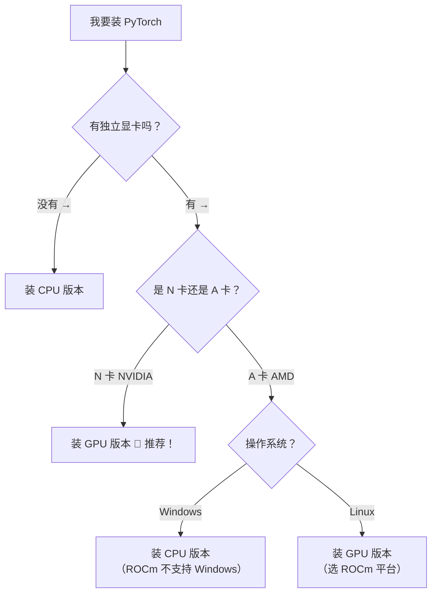

# 🧠 第一部分：PyTorch 入门与安装

> 📺 视频来源：PyTorch 基本介绍 · CPU/GPU 安装 · CUDA 配置
> 🎯 适合人群：深度学习初学者
> 📝 风格：代码实践 + 通俗讲解

---

## 📌 一、PyTorch 是什么？为什么要学它？

### 1.1 从"手写"到"调库"

前面我们学神经网络的时候，是不是手动实现了前向传播、反向传播、梯度下降？那些代码帮助我们**理解原理**。

但真正到实际工程中，没人会手写这些东西 —— 就像你不会自己造轮子一样 🛞

**工程应用 = 调库**，深度学习有自己的专业框架。

之前学机器学习我们用 `scikit-learn`（sklearn），但深度学习的特点是：

| 机器学习 | 深度学习 |
|---------|---------|
| 数据维度低 | **高维张量**（图片、视频、文本） |
| 没有反向传播 | **自动求梯度**是核心 |
| sklearn 就够用 | 需要专业的深度学习框架 |

### 1.2 PyTorch 的前世今生

```
        Torch 库（底层 C 语言，接口用 Lua）
                  ↓
     2016 年 Facebook 给它做了 Python 接口
                  ↓
           PyTorch = Python + Torch
                  ↓
       现在：业界最火的深度学习框架 🔥
```

**名字拆解**：
- **Py** = Python（你会的那个 Python）
- **Torch** = 火炬（前身是一个叫 Torch 的科学计算框架）

### 1.3 PyTorch vs TensorFlow（为啥选 PyTorch？）

在深度学习发展史上，有两个最著名的框架：

| 对比维度 | PyTorch 🔥 | TensorFlow 🔵 |
|---------|-----------|-------------|
| **开发团队** | Facebook（Meta） | 谷歌 |
| **上手难度** | 🟢 **超简单**，跟 numpy 几乎一样 | 🔴 偏底层，像学一门新语言 |
| **计算图** | 动态计算图（灵活，好调试） | 静态计算图（先建图再编译，僵化） |
| **API 设计** | 简洁直观 | 经常被吐槽，2.0 大改版还不兼容旧版 |
| **学术界** | 📚 主流！论文代码都用 PyTorch | 越来越少 |
| **工业界** | 🔥 迎头赶上，生态越来越好 | 曾经的主流，但逐渐被替代 |

> **结论**：现在学深度学习，**默认直接学 PyTorch 就行了**，不用再学 TensorFlow 了。

### 1.4 PyTorch 的两大核心能力

```
PyTorch
    ├── 🎯 跟 NumPy 几乎一样的张量操作（tensor）
    └── 🚀 自动微分系统（autograd）—— 自动算梯度！
```

- **张量（Tensor）**：就是多维数组，跟 NumPy 的 ndarray 几乎一模一样
- **自动微分（Autograd）**：帮你自动算反向传播的梯度 —— 再也不用手写链式法则了！

---

## 🚀 二、安装前的准备工作

### 2.1 CPU 版本 vs GPU 版本

PyTorch 分两个版本：

```
PyTorch 版本
    ├── CPU 版本 🐢 → 用 CPU 算，数据在内存里
    └── GPU 版本 🚀 → 用显卡算，数据在显存里
```

**一定要搞清楚**：深度学习的核心是**大规模矩阵运算**，这种场景显卡（GPU）有天然优势。

### 2.2 CPU 和 GPU 的"神类比" 🎯

> **CPU = 一个博士生** 🎓
> **GPU = 100 个小学生** 👦👧👦👧...

| 任务 | 谁厉害？ |
|------|---------|
| 处理复杂任务（打开浏览器、运行游戏） | 🟢 **博士生**（CPU）厉害 |
| 跑 20 以内的加减乘除四则运算 | 🟢 **100 个小学生**（GPU）厉害！并行计算 |

深度学习就是要做**海量的简单矩阵运算**，所以 GPU 的并行计算能力完胜！

### 2.3 到底装哪个版本？



> 💡 **重要提示**：初学者阶段，CPU 和 GPU 版本**几乎没有差别**。我们做的案例模型都很小，CPU 跑得飞快。只有到训练大模型的时候，差别才体现出来。甚至真到大模型阶段，你自己的显卡也带不动，得上云租服务器。

---

## 🔧 三、PyTorch 安装实战（命令行版）

### 3.1 第一步：去官网找安装命令

打开 [pytorch.org](https://pytorch.org)，你会看到一个配置表格：

```
PyTorch Build:  2.8.0 （稳定版，选这个）
Your OS:        Windows / Linux / Mac
Package:        Pip （推荐）
Language:       Python （你用的）
Compute Platform: CPU / CUDA 12.6 / CUDA 12.8 / CUDA 12.9
```

选好之后，页面会自动生成安装命令，复制粘贴就能装。

### 3.2 安装 CPU 版本（最简单）

```bash
# CPU 版本 — 一行命令搞定
pip install torch torchvision torchaudio
```

**就这么简单！** 没有任何其他参数。

> 从 PyTorch 2.8.0 开始，`torchaudio` 已经合并到 `torch` 里了，但 `torchvision`（图像处理）还得单独装。

### 3.3 安装 GPU 版本（稍微麻烦一点）

GPU 安装的核心就一句话：

> **选一个不超过你显卡支持的最高 CUDA 版本的 PyTorch 版本**

怎么选？往下看 👇

---

## 🛠️ 四、建议：用虚拟环境安装（推荐做法）

### 4.1 为什么要用虚拟环境？

> **虚拟环境 = 一个独立的 Python 小房间** 🏠
> 每个项目都有自己的房间，互不干扰。

直接装在 base 环境也可以，但推荐**新建一个虚拟环境**，因为：
- PyTorch 比较大，集中管理方便
- 不同项目可能需要不同版本的 PyTorch
- 环境隔离，互不影响

### 4.2 创建虚拟环境

```bash
# 用 conda 创建虚拟环境（名字自己取，比如 pytorch_env）
conda create -n pytorch_env python=3.12

# 建议指定 Python 版本（3.12），不然默认装最新版容易乱
```

> 💡 Python 版本建议指定 `3.12`，稳定兼容性好。如果不指定，conda 会装最新版（当前是 3.13），有些包可能还没适配。

### 4.3 激活虚拟环境

```bash
# Windows 下激活
conda activate pytorch_env

# 看到命令提示符前面变成了 (pytorch_env) → 说明进入成功
```

### 4.4 配置国内镜像源（下载加速）

默认 pip 源在国外，下载慢可以配成国内源：

```bash
# 配置清华镜像源（推荐）
pip config set global.index-url https://pypi.tuna.tsinghua.edu.cn/simple
```

### 4.5 在虚拟环境中安装 PyTorch

```bash
# 进入虚拟环境后，直接执行你在官网上复制的命令
# CPU 版：
pip install torch torchvision torchaudio

# GPU 版（以 CUDA 11.8 为例）：
pip install torch torchvision torchaudio --index-url https://download.pytorch.org/whl/cu118
```

### 4.6 安装常用库

新建的虚拟环境里只有最基本的包，你常用的库需要自己装：

```bash
# 建议至少装上 jupyter notebook，方便后面做测试
pip install jupyter notebook

# 其他常用库（需要时再装）
pip install pandas matplotlib scikit-learn
```

### 4.7 在 IDE 中切换解释器

如果你用 PyCharm 或 VS Code：

```
PyCharm 设置：
File → Settings → Project → Python Interpreter
    → 选择你刚创建的 conda 环境 (pytorch_env)
    
或者新建项目时：
New Project → Custom Environment → Select Existing → Conda → 选 pytorch_env
```

---

## 🎯 五、GPU 版本安装全流程（重点！）

### 5.1 三步走战略

```
第 1 步：查显卡型号 → 确定计算能力
第 2 步：查最高 CUDA 版本
第 3 步：选对应 PyTorch 版本 → 执行安装命令
```

### 5.2 第 1 步：查看显卡型号

**方法**：打开电脑的「设备管理器」→「显示适配器」

你会看到类似这样的信息：
```
NVIDIA GeForce RTX 3050 Ti   ← 你的显卡型号
```

### 5.3 第 2 步：查计算能力

去 NVIDIA 官网查你的显卡**计算能力**：
- 打开这个网页：https://developer.nvidia.com/cuda-gpus
- 找到你的显卡型号，看对应的 **Compute Capability**
- **要求 >= 3.0**（最近几年买的电脑都满足）

### 5.4 第 3 步：查最高支持的 CUDA 版本 ⭐

**推荐方法 — 用 nvidia-smi 命令：**

```bash
# 打开命令行（CMD 或 Anaconda Prompt 都行）
nvidia-smi
```

你会看到类似这样的输出：

```
+-----------------------------------------------------------------------------+
| NVIDIA-SMI  xxx.xx    Driver Version: xxx.xx       CUDA Version: 12.3       |
|-------------------------------+----------------------+----------------------+
| GPU  Name        Persistence-M| Bus-Id        Disp.A | Volatile Uncorr. ECC |
| Fan  Temp  Perf  Pwr:Usage/Cap|         Memory-Usage | GPU-Util  Compute M. |
|===============================+======================+======================|
|   0  NVIDIA GeForce ...  Off  | 00000000:01:00.0 Off |                  N/A |
| N/A   52°C    P0    N/A /  60W|      0MiB /  4096MiB |      0%      Default |
|-------------------------------+----------------------+----------------------+
|                                                                              |
| Processes:                                                                   |
|  GPU   GI   CI        PID   Type   Process name                  GPU Memory |
|  No running processes found                                                 |
+-----------------------------------------------------------------------------+
```

**重点看这一行：**
```
CUDA Version: 12.3   ← 你的显卡支持的最高 CUDA 版本
```

> 💡 **备用方法**：打开「NVIDIA 控制面板」→ 左下角「系统信息」→「组件」标签 → 找 `CUDA 64.dll`

### 5.5 第 4 步：根据 CUDA 版本选择 PyTorch 版本

**原则：** PyTorch 基于的 CUDA 版本 ≤ 你显卡支持的 CUDA 版本

| 你的 CUDA 版本 | 可以选 PyTorch 基于的 CUDA 版本 |
|---------------|-------------------------------|
| 12.6 | 12.6 ✅（完美匹配）、12.4、11.8 ... |
| 12.3 | 11.8 ✅（不超过 12.3 就行） |
| 12.9 | 12.9 ✅（完美匹配） |
| 13.0 | 12.9（因为 PyTorch 最新只到 12.9） |

> **CUDA 向前兼容**：高版本 CUDA 支持低版本编译的程序。所以你显卡是 12.3，选 11.8 的 PyTorch 完全没问题。

**举例：**

如果你的显卡最高支持 CUDA 12.3：
```bash
# PyTorch 2.7.0 有基于 CUDA 11.8 的版本（≤ 12.3，可以用）
pip install torch==2.7.0 torchvision==0.22.0 torchaudio==2.7.0 --index-url https://download.pytorch.org/whl/cu118
```

如果你的显卡最高支持 CUDA 12.6+：
```bash
# 直接选最新版，完美匹配
pip install torch torchvision torchaudio --index-url https://download.pytorch.org/whl/cu126
```

### 5.6 nvidia-smi 的其他有用信息

`nvidia-smi` 不只可以查 CUDA 版本，以后跑模型的时候你还会经常用它来看性能：

| 指标 | 含义 | 怎么看 |
|-----|------|-------|
| **GPU-Util** | GPU 利用率 | 0% 说明没跑东西，100% 说明跑满了 |
| **Memory-Usage** | 显存占用 | 比如 `2048MiB / 4096MiB` = 用了 2G，总共 4G |
| **Temp** | GPU 温度 | 一般 40-80°C 正常，太高要注意散热 |
| **Fan** | 风扇转速 | 温度高了风扇会转得快 |
| **Perf** | 性能状态 | P0（最大性能）~ P12（最小性能） |
| **PWR** | 功率 | 当前功率 / 最大功率 |
| **Processes** | 正在跑的进程 | 能看到哪个程序在占显卡 |

---

## 📦 六、CUDA Toolkit 安装（可选）

### 6.1 我需要装 CUDA Toolkit 吗？

```
你现在用 PyTorch 需要 CUDA 吗？
    ├── 只是用 PyTorch 训练模型 → ❌ 不需要！
    └── 想做 CUDA 编程（直接写 GPU 代码）→ ✅ 需要
```

> **好消息**：现在的 PyTorch 版本已经**内嵌了 CUDA 支持**，相关的 DLL 文件都打包好了。
> 早期版本需要先装 CUDA Toolkit，现在不需要了！

### 6.2 如果想装，怎么装？

去 [NVIDIA CUDA 官网](https://developer.nvidia.com/cuda-toolkit-archive)：

1. 选择你需要的 CUDA 版本（比如 11.8 或 12.3）
2. 选择操作系统（Windows x86_64）
3. 选择安装方式（推荐 Local，约 3GB）
4. 下载 exe 文件，一路「下一步」傻瓜式安装

安装完成后验证：
```bash
nvcc --version
# 输出类似：nvcc: NVIDIA (R) Cuda compiler driver
#          release 11.8, V11.8.89
```

---

## ⚠️ 七、常见问题 & 避坑指南

### Q1：我该装最新版还是历史版本？

> ✅ **推荐装最新版**。除非你的显卡不支持最新版对应的 CUDA 版本。

### Q2：Windows + A 卡（AMD）能装 GPU 版吗？

> ❌ **目前不行**。ROCm（AMD 的 CUDA）还不支持 Windows。只能装 CPU 版，或者换 Linux 系统。

### Q3：装 GPU 版比 CPU 版大很多吗？

> ✅ 是的。GPU 版因为包含了 CUDA 支持，包会大一些。但下载一次就行了。

### Q4：下载太慢怎么办？

```bash
# 可以加国内镜像源加速
pip install torch torchvision torchaudio -i https://pypi.tuna.tsinghua.edu.cn/simple
```

或者下载 whl 文件离线安装（让下载好的同学分享给你）。

### Q5：torchvision 和 torchaudio 是什么？

| 包名 | 用途 | 说明 |
|-----|------|------|
| **torch** | PyTorch 核心 | 张量操作、神经网络、自动微分 |
| **torchvision** | 计算机视觉 | 图像处理、数据集、预训练模型 |
| **torchaudio** | 语音/音频 | 音频处理（2.8.0 起合并到 torch 了） |

---

## 📝 八、本章总结

### 知识地图

```
PyTorch = 当前最火的深度学习框架 🔥
    ↓
分 CPU 版（简单）和 GPU 版（快，但稍麻烦）
    ↓
GPU 安装三步走：
    ① nvidia-smi 查 CUDA 版本
    ② 官网选不超过该版本的 PyTorch
    ③ 复制命令，pip install 搞定
    ↓
CUDA Toolkit → 可装可不装（PyTorch 已内嵌）
    ↓
CPU 版一行命令搞定 → 初学者也能用
```

### 速查命令大全

```bash
# 查看显卡信息
nvidia-smi

# 查看 CUDA Toolkit 版本
nvcc --version

# 查看已安装的 PyTorch 信息
pip show torch

# 安装 CPU 版 PyTorch（最新版）
pip install torch torchvision torchaudio

# 安装 GPU 版 PyTorch（CUDA 11.8）
pip install torch torchvision torchaudio --index-url https://download.pytorch.org/whl/cu118

# 安装 GPU 版 PyTorch（CUDA 12.6）
pip install torch torchvision torchaudio --index-url https://download.pytorch.org/whl/cu126

# 查看 conda 有哪些虚拟环境
conda env list

# 创建新虚拟环境（Python 3.12）
conda create -n pytorch_env python=3.12

# 激活虚拟环境
conda activate pytorch_env

# 配置清华镜像源（加速下载）
pip config set global.index-url https://pypi.tuna.tsinghua.edu.cn/simple
```

### 安装后验证

装完后，有几种方法可以验证是否安装成功：

#### 方法一：pip 查看（快速检查）

```bash
# 在命令行直接查看
pip show torch
```

输出示例：
```
Name: torch
Version: 2.7.0+cu118
Summary: Tensors and Dynamic neural networks in Python with strong GPU acceleration
...
```

> 看到 `Version: 2.7.0+cu118` 中的 `+cu118` 就说明装的是 CUDA 11.8 的 GPU 版本。

#### 方法二：在 Python 中 import（最靠谱）

打开命令行，激活你的虚拟环境，然后直接敲 `python` 进入交互模式：

```bash
conda activate pytorch_env
python
```

然后在 Python 里 import：

```python
import torch  # 如果卡一下才出结果 → 说明加载成功！
             # 如果直接报错 → 说明没装好
```

#### 方法三：完整验证脚本（推荐）

创建一个 `.py` 文件或在 Jupyter Notebook 中运行：

```python
import torch

# 1. 查看 PyTorch 版本
print(f"PyTorch 版本: {torch.__version__}")

# 2. 创建一个张量
x = torch.tensor([1, 2, 3])
print(f"张量: {x}")

# 3. 检查 GPU 是否可用
print(f"CUDA 是否可用: {torch.cuda.is_available()}")
if torch.cuda.is_available():
    print(f"显卡名称: {torch.cuda.get_device_name(0)}")
    print(f"CUDA 版本: {torch.version.cuda}")
    
    # 4. 查看 cuDNN 版本（深度学习加速库）
    print(f"cuDNN 版本: {torch.backends.cudnn.version()}")
```

输出示例：
```
PyTorch 版本: 2.7.0+cu118
张量: tensor([1, 2, 3])
CUDA 是否可用: True
显卡名称: NVIDIA GeForce RTX 3050 Ti
CUDA 版本: 11.8
cuDNN 版本: 90100
```

> 🎉 看到 `CUDA 是否可用: True` 就说明 GPU 版安装成功了！
>
> `cuDNN` 是基于 CUDA 的深度神经网络加速库，**PyTorch 已经内嵌了**，不用单独安装。

---

---