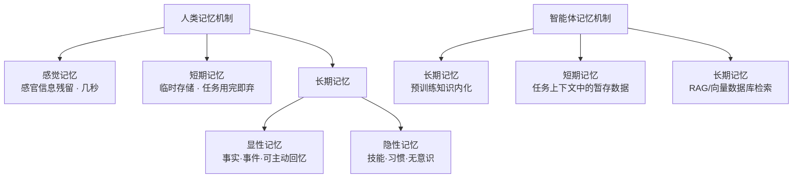

# Agent 智能体开发（第一节课）— 初见老师

## 1. 课程元信息

- **课程主题**：Agent智能体开发入门 — 记忆机制、工具使用与 Function Calling
- **主讲老师**：初见老师
- **适用阶段**：进阶（需具备 Python 基础 + LangChain / LLM 基础概念 + LlamaIndex 工作流基础）
- **前置知识**：
  - Python 基础编程
  - 大模型 API 调用（OpenAI / 千问等）
  - LangChain 框架基础（上节课已讲 React Agent）
  - LlamaIndex 工作流基础（上节课已讲 workflow 基本概念）
  - Git 基本安装与使用
- **时长**：约 2 小时 20 分钟

---

## 2. 核心概念图谱

### 2.1 Agent 相关概念

| 中文术语 | 英文术语 | 通俗解释 |
|---------|---------|---------|
| 智能体 | Agent | 能感知环境、自主规划、调用工具完成任务的大模型应用系统 |
| 智能体记忆 | Agent Memory | 智能体保持对话上下文和历史状态的能力 |
| 工具使用 | Tool Using | 智能体通过调用外部工具（搜索、API、数据库等）突破自身限制 |
| 感觉记忆 | Sensory Memory | 感官信息的短暂残留，持续几秒（如脑中一闪而过的念头） |
| 短期记忆 | Short-term Memory | 临时存储少量信息，任务结束后即清空（如临时记的电话号码） |
| 长期记忆 | Long-term Memory | 持久存储大量信息，依赖向量数据库 / RAG 实现 |
| 显性记忆 | Explicit Memory | 可主动回忆的知识（如背过的课文、重要的个人经历） |
| 隐性记忆 | Implicit Memory | 形成习惯或技能的潜意识记忆（如骑自行车、熟练敲代码） |
| 工具列表 | Tool List | 智能体可调用的多个工具的集合 |

### 2.2 Function Calling 相关概念

| 中文术语 | 英文术语 | 通俗解释 |
|---------|---------|---------|
| 函数调用 | Function Calling | 大模型自动选择并调用外部函数/API 的能力 |
| 函数定义 | Function Definition | 用 JSON Schema 格式描述函数的名称、参数类型等信息 |
| 意图识别 | Intent Recognition | 大模型理解用户请求并判断是否需要调用函数 |
| 结构化输出 | Structured Output | 大模型不直接输出自然语言，而是输出结构化的函数调用请求 |
| 外部执行器 | External Executor | 大模型自身不执行函数，由外部代码/中间件代为执行 |
| 响应组合 | Response Composition | 将函数执行结果反馈给大模型，由大模型生成最终自然语言回答 |

### 2.3 框架与平台概念

| 中文术语 | 英文术语 | 通俗解释 |
|---------|---------|---------|
| 思维链推理 | ReAct (Reasoning + Acting) | 让智能体"思考 → 规划 → 行动 → 反思"的循环策略 |
| 函数调用智能体 | OpenAI Function Agent | LangChain 中使用 OpenAI function calling 能力实现的 Agent 策略 |
| 模型上下文协议 | MCP (Model Context Protocol) | 统一工具接口标准的协议，解决工具调用格式不统一问题 |
| 检索增强生成 | RAG (Retrieval-Augmented Generation) | 通过向量数据库检索外部知识辅助大模型生成回答 |

---

## 3. 技术原理 / 流程拆解

### 3.1 人类记忆机制 → 智能体记忆机制



**流程详解：**
1. **人类感觉记忆** → 对应大模型预训练阶段内化的世界知识（长期记忆）
2. **人类短期记忆** → 对应智能体单次任务中的上下文暂存（任务结束即清空）
3. **人类长期记忆** → 对应智能体的 RAG 系统（向量数据库存储和检索）

### 3.2 Function Calling 核心流程

```
[用户提问] → [大模型] ─┬─→ [不调用函数] → [直接回复]
                        └─→ [调用函数] → [识别函数ID/名称/参数] → [手动执行函数] 
                              → [获取函数返回值] → [将结果传回大模型] → [生成最终回答]
```

**标准操作流程（SOP）：**

**Step 1 — 定义函数**
- 编写 JSON Schema 格式的函数描述（名称、参数类型、说明）
- 确保函数功能可独立测试

**Step 2 — 大模型识别与决策**
- 大模型接收用户问题
- 大模型判断是否需要调用函数
- 如需调用，输出结构化的函数调用请求（含函数 ID、名称、参数）

**Step 3 — 手动执行函数**
- 外部代码根据大模型输出的函数名和参数，手动调用对应函数
- 函数的实际执行由外部执行器完成，大模型不参与执行

**Step 4 — 结果反馈与响应**
- 将函数执行结果（返回值）组装为新的消息（角色设为 "tool"）
- 将消息传回大模型
- 大模型基于函数的返回内容生成最终的自然语言回答

### 3.3 LlamaIndex 工作流部署流程（新版）

```
[创建空文件夹] → [运行 llamainit 命令] → [填写项目名/配置] → [拉取 .yaml 配置文件]
    → [创建 src/workflow.py] → [编写工作流代码] → [启动服务 (llama deploy)]
    → [部署工作流 (llama deploy -- xxx)] → [通过 HTTP/REST 调用工作流]
```

**SOP：**
1. 安装 Git（底层依赖 git 拉取模板文件）
2. 创建空白文件夹，在 CMD 中进入
3. 运行 `llamainit` 命令，填写项目名称等信息
4. 拉取配置文件（yaml 格式），编辑配置（模型 key、base_url、input_path 等）
5. 创建 `src/workflow.py`，编写工作流代码
6. 使用 `llama deploy` 启动本地服务
7. 使用 `llama deploy` + 配置文件名部署工作流到服务
8. 通过 Python requests 或命令行方式调用工作流

### 3.4 Agent 使用工具的标准流程

```
[加载大模型] → [加载工具（如搜索）] → [放入工具列表] 
    → [使用 ReAct Agent / OpenAI Function Agent] → [agent.run(用户问题)]
```

---

## 4. 案例 / 代码实战复盘

### 4.1 案例一：LlamaIndex 工作流部署

- **目标**：掌握新版 LlamaIndex 工作流的创建、配置、部署和调用
- **关键步骤**：
  1. 安装 Git
  2. 运行 `llamainit` 生成配置
  3. 配置 `.env` 和 yaml 文件
  4. 编写 `src/workflow.py`
  5. 启动服务 + 部署工作流

**配置文件要点（yaml）：**
```yaml
name: "rag_workflow"
type: local
path: src
input_path: src/workflow.py
```

**配置文件中需要注意的规范：**
- 使用冒号 `:` 格式（不是等号 `=`）
- 不要加引号
- `input_pass` 路径必须与工作流文件路径一致
- 暴露的对象名必须与 yaml 配置中的一致

**服务启动与调用：**
```bash
# 启动服务
llama deploy

# 部署工作流（需在配置文件所在目录执行）
llama deploy -- <配置文件名称>

# 命令行调用
llama run --deployment <部署名> --arg <key>=<value> --arg <key2>=<value2>
```

**Python HTTP 调用方式：**
```python
import requests
import json

# 参数
params = {"name": "肖炎", "father": "肖战"}
params_json = json.dumps(params)

# 调用工作流接口
payload = {"input": params_json}
response = requests.post(
    "http://localhost:<port>/api/deployment/<deploy_name>/task/run",
    json=payload
)
```

**输入/输出分析：**
| 模块 | 输入 | 处理 | 输出 |
|------|------|------|------|
| 工作流节点1 | 用户参数（name, father） | 获取参数并传入工作流 | 中间结果 |
| 部署服务 | 工作流代码 + 配置 | 启动本地 HTTP 服务 | 服务 URL |
| HTTP 调用端 | 服务 URL + JSON 参数 | POST 请求发送参数 | 工作流执行结果 |

### 4.2 案例二：Agent 使用搜索工具

- **目标**：构建一个具有联网搜索能力的 Agent
- **工具**：Tavily 搜索（每月 1000 次免费）

**关键代码逻辑：**
```python
from langchain_openai import ChatOpenAI
from langchain.agents import create_react_agent, AgentExecutor
from langchain_tavily import TavilySearch

# 1. 加载模型
llm = ChatOpenAI(model="qwen-plus", ...)

# 2. 加载工具
search = TavilySearch()
tools = [search]  # 工具列表

# 3. 创建 Agent
agent = create_react_agent(llm, tools, prompt)
agent_executor = AgentExecutor(agent=agent, tools=tools)

# 4. 执行
result = agent_executor.invoke({"input": "用户问题"})
```

**输入/输出分析：**
| 模块 | 输入 | 处理 | 输出 |
|------|------|------|------|
| TavilySearch | 搜索关键词 | 调用 Tavily API 执行搜索 | 搜索结果文本 |
| ReAct Agent | 用户问题 + 工具列表 | 思考 → 规划 → 调用工具 → 反思 | 最终回答 |
| AgentExecutor | Agent + 工具 | 编排执行流程 | 执行结果 |

### 4.3 案例三：Function Calling 基本原理（待下节课展开）

- **目标**：理解大模型如何通过 function calling 调用外部函数
- **本质**：模型输出结构化的 JSON 调用请求 → 外部代码手动执行 → 结果回传模型

**伪代码逻辑：**
```python
# 1. 定义函数 schema
functions = [
    {
        "name": "get_weather",
        "description": "获取天气信息",
        "parameters": {
            "type": "object",
            "properties": {
                "location": {"type": "string"}
            }
        }
    }
]

# 2. 大模型识别 -> 返回函数调用信息
response = llm.chat(messages, functions=functions)
# response 包含: function_call = {name: "get_weather", arguments: '{"location": "北京"}'}

# 3. 手动执行函数
result = get_weather("北京")

# 4. 结果回传 -> 大模型生成最终回答
second_response = llm.chat(messages + [response] + [{"role": "tool", "content": result}])
```

---

## 5. 避坑指南（隐性知识提取）

### 5.1 工具与环境配置

| 问题 | 说明 | 解决方案 |
|------|------|---------|
| Git 未安装 | `llamainit` 依赖 git 从 GitHub 拉取模板文件 | 提前安装 Git，一直点击下一步即可 |
| 配置文件格式错误 | yaml 文件用冒号 `:` 不是等号 `=`，不要加引号 | 严格按示例格式编写 |
| 路径不一致 | `input_pass` 路径必须与实际工作流文件位置一致 | 仔细核对路径 |
| 对象名不匹配 | yaml 配置中暴露的对象名必须与 Python 代码中一致 | 保持两端名称一致 |

### 5.2 模型选择与显存

| 问题 | 说明 | 建议 |
|------|------|------|
| 本地小模型不支持 Function Calling | 4B/6B/7B 模型在蒸馏/剪枝时会砍掉函数调用能力 | 使用 >= 8B 的模型（如千问 8B） |
| 千问 Turbo 性价比高但功能被砍 | 主打性价比的模型会削减部分能力 | 使用千问 Plus 或 Max |
| 企业建议 | 32B 模型效果较好 | 不低于 16B，低于则能力下降明显 |
| 学习阶段建议 | 避免本地模型导致的"代码一样但跑不通"问题 | 前期使用线上满血版 API |
| 本地模型底线 | 千问3 8B 左右开始支持 function calling | 但小模型能力越差，>=16B 起步 |

### 5.3 Agent 开发常见陷阱

| 问题 | 说明 | 解决方案 |
|------|------|---------|
| 工具接口不规范 | 不同工具返回值格式各异（JSON/字符串等） | 引入 MCP 统一标准 |
| 调用失败率高 | 格式错误导致流程中断 | 统一入参和返回值格式 |
| 上下文丢失 | Agent 记忆混乱 | 使用向量数据库或知识图谱存储记忆 |
| 缺乏停止条件 | Agent 无限循环调用 | 设置最大调用次数 + 超时机制 |
| 缺乏反馈闭环 | Agent 不知道回答是否正确 | 引入用户评分/反馈系统 |
| 意图识别不足 | 用户需求模糊导致 Agent 陷入死循环 | 加入意图识别，先澄清需求再执行 |

### 5.4 命名与格式规范

- yaml 配置文件中使用冒号 `:` 分隔，**不能使用等号 `=`**
- yaml 中**不要加引号**
- 项目名称建议**全小写**
- 工作流暴露的对象名必须与 yaml 配置中的名称**严格一致**
- 函数调用时参数必须是 **JSON 格式**
- HTTP 调用时参数包装在 `input` 字段中

---

## 6. 对比与思考

### 6.1 Function Calling vs Agent 工具调用

| 维度 | Function Calling | Agent 工具调用 |
|------|-----------------|---------------|
| **本质** | 大模型调用单个函数的能力 | 有目标、有策略的任务执行流程 |
| **复杂性** | 一次调用一个函数 | 可规划多步，每步调用不同工具 |
| **智能程度** | 仅做"打电话"式的单次查询 | 如助理般整体处理流程 |
| **规划能力** | 无，仅根据当前输入决定是否调用 | 有，会提前规划先做什么后做什么 |
| **多轮调用** | 需手动编排多轮 | 自动进行多轮工具调用 |
| **底层关系** | Agent 工具调用的底层实现方式之一 | 可基于 Function Calling 或 ReAct 实现 |
| **类比** | 打电话问天气预报公司 | 助理帮你查天气 + 建议穿衣 + 安排行程 |

**老师原话总结：**
> "Function Calling 是真正动手的能力，而当你有了 Agent，你还必须给它 Function Calling，它才能把任务规划变成实际操作。Agent 比 Function Calling 大一级，Function Calling 是它的小弟。"

### 6.2 ReAct Agent vs OpenAI Function Agent

| 维度 | ReAct Agent | OpenAI Function Agent |
|------|-------------|----------------------|
| **调用工具方式** | 通过 Action 自动调用 | 通过 OpenAI function calling 能力调用 |
| **思考模式** | 思考 → 规划 → 行动 → 反思 | 识别用户意图 → 选择函数 → 调用 |
| **模型要求** | 通用大模型即可 | 必须支持 function calling 的大模型 |
| **底层原理** | 通过 Prompt 引导模型思考并输出 Action | 大模型原生支持结构化函数调用输出 |
| **适用场景** | 通用 Agent 开发 | 与 OpenAI 兼容 API 的模型 |

### 6.3 主流多智能体框架对比

| 框架 | 核心特点 | 优势 | 劣势 | 适用场景 |
|------|---------|------|------|---------|
| **AutoGPT** | 自主分解任务、循环执行 | 无需过多人工干预 | 缺乏最大限制，容易无限循环消耗资源 | 简单自动化任务 |
| **MetaGPT** | 模拟软件团队（PM/开发/测试等角色） | 中文友好、角色分工明确、工程化思维强、易于本地部署 | 任务输入输出格式要求高，难以统一 | 软件工程团队、产品策划、企业应用 |
| **CrewAI** | 多 Agent 协作框架 | 角色清晰、协作流程灵活 | 相对较新 | 多角色协作场景 |

**老师观点：** 目前主流还是使用 LangGraph 或 AutoGPT，框架选择取决于业务场景。

### 6.4 为什么 Agent 落地难（7 大核心难点）

| 难点 | 表现 | 解决方案 |
|------|------|---------|
| 1. 任务定义模糊 | 用户需求不具体，Agent 无法拆解任务，陷入无限循环 | 加入意图识别，先澄清需求再执行 |
| 2. 控制与约束能力弱 | 缺乏停止条件、错误处理、资源限制策略 | 设置最大调用次数 + 超时机制 |
| 3. 外部工具集成困难 | 各工具接口不规范，入参/返回值格式不统一 | 引入 MCP 统一标准 |
| 4. 记忆与上下文管理复杂 | 上下文丢失、重复操作、逻辑混乱 | 向量数据库 / 知识图谱增强记忆 |
| 5. 评估与反馈机制缺失 | Agent 难以自我优化，无法判断任务是否真正完成 | 引入任务评分系统 + 用户反馈闭环 |
| 6. 安全与隐私风险 | 可能访问敏感数据、执行危险命令、泄露隐私 | 权限分级 + 加密通信 + 数据脱敏 |
| 7. 用户体验差 | 用户难以理解 Agent 的思考过程，信任度低 | 提升透明度和可解释性 |

### 6.5 课后思考与延伸

1. **老师留下的思考题**：为什么 Agent 落地这么难？大家有什么想法？
2. **延伸学习方向**：
   - MCP（Model Context Protocol）统一工具接口
   - LangGraph 工作流框架
   - 更多 Agent 框架对比与实践
   - 下节课预告：Function Calling 实战案例（薪资统计、爬虫、MySQL 查询）

---

## 7. 本节课思维导图

- Agent 智能体开发（第一节课）
  - 课前回顾
    - LlamaIndex 工作流部署（新版）
      - 使用 `llamainit` 命令生成配置
      - 配置 yaml 文件（注意冒号格式，不加引号）
      - 创建 src/workflow.py
      - `llama deploy` 启动服务
      - HTTP / 命令行两种调用方式
      - 新版更简洁（无需创建多个文件）
  - Agent 记忆机制
    - 人类记忆
      - 感觉记忆（几秒）
      - 短期记忆（临时存储）
      - 长期记忆
        - 显性记忆（事实/事件）
        - 隐性记忆（技能/习惯）
    - 智能体记忆
      - 预训练内化 → 长期记忆
      - 任务上下文暂存 → 短期记忆
      - RAG/向量数据库 → 长期记忆
  - Agent 工具使用
    - Tavily 搜索工具（每月1000次免费）
    - 工具列表概念（单个 Agent 可挂载多个工具）
    - Agent = 大脑（大模型）+ 手脚（工具）
  - 主流多智能体框架介绍
    - AutoGPT
    - MetaGPT（软件工程团队模拟）
    - CrewAI（多角色协作）
    - 目前主流：LangGraph / AutoGPT
  - 为什么 Agent 落地难
    - 任务定义模糊 → 意图识别
    - 控制约束弱 → 设上限和超时
    - 工具集成难 → MCP 统一标准
    - 记忆管理复杂 → 向量数据库/知识图谱
    - 评估反馈缺失 → 评分系统 + 用户反馈
    - 安全隐私风险 → 权限控制 + 加密
    - 用户体验差 → 提升可解释性
  - Function Calling 详解
    - 起源：传统大模型的局限性
      - 封闭黑盒结构
      - 缺乏可控性和可扩展性
      - 长上下文限制
    - 核心概念
      - 函数定义（JSON Schema）
      - 意图识别
      - 结构化输出
      - 外部执行器
      - 响应组合
    - 标准流程（SOP）
      - Step 1: 定义函数
      - Step 2: 大模型识别问题 → 决定调用函数 → 输出函数ID/名称/参数
      - Step 3: 手动执行函数（外部执行器）
      - Step 4: 获取返回值 → 回传大模型 → 生成最终回答
    - vs Agent 工具调用的区别
      - Function Calling = 单次函数调用能力（电话）
      - Agent = 全流程任务规划（助理）
      - Agent 比 Function Calling 大一级
      - Agent 工具调用的底层可用 Function Calling 实现
    - ReAct vs OpenAI Function Agent
      - ReAct：思考→规划→行动→反思
      - OpenAI Function Agent：基于 function calling 策略
      - 两种不同的工具调用策略
    - 模型选择建议
      - 本地模型推荐 >= 16B（千问 Plus/Max）
      - 学习阶段先用线上满血版
      - 小模型（<8B）不支持或支持不好 function calling
