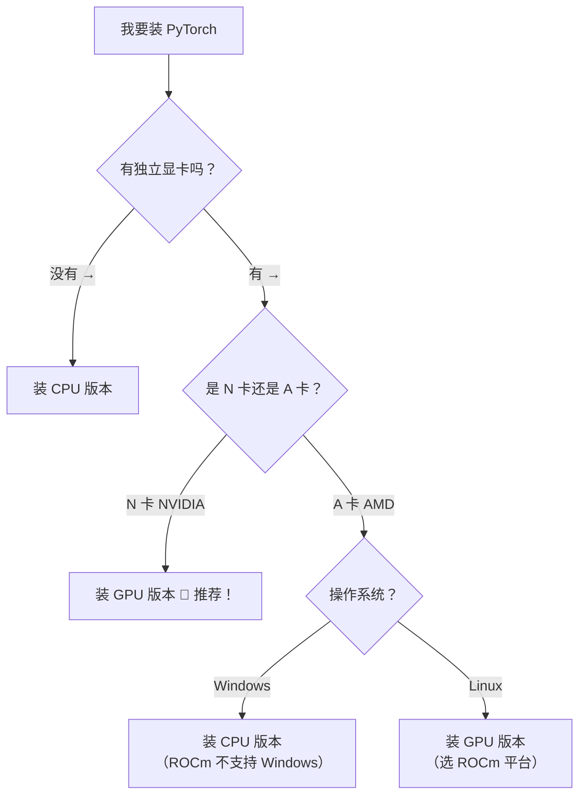

# 🧠 深度学习笔记 — PyTorch 从入门到张量操作

> 📝 本笔记为 PyTorch 学习系列合集，适合深度学习初学者
> 🎯 风格：代码实践 + 通俗讲解

---

## 📋 目录

### 第一部分：PyTorch 入门与安装
- **一、** PyTorch 是什么？为什么要学它？
- **二、** 安装前的准备工作（CPU vs GPU）
- **三、** PyTorch 安装实战（命令行版）
- **四、** 建议：用虚拟环境安装（推荐做法）
- **五、** GPU 版本安装全流程
- **六、** CUDA Toolkit 安装（可选）
- **七、** 常见问题 & 避坑指南
- **八、** 本章总结 + 速查命令 + 安装验证

### 第二部分：PyTorch 张量创建
- **一、** 创建张量的两大类场景
- **二、** 按内容创建 — `torch.tensor()`
- **三、** 按形状创建 — `torch.Tensor()`
- **四、** 核心对比：`tensor()` vs `Tensor()`
- **五、** 指定数据类型（dtype）
- **六、** 指定区间创建（arange / linspace / logspace）
- **七、** 按数值填充（zeros / ones / full / empty / eye）
- **八、** 随机生成（rand / randint / randn / normal / randperm / seed）
- **九、** 类比理解：张量的"维度"
- **十、** 常见问题 & 避坑指南
- **十一、** 本章总结

### 第三部分：PyTorch 张量转换
- **一、** 张量元素类型转换（type / float / int / long / bool）
- **二、** Tensor ↔ NumPy 转换（内存共享 & 避免共享）
- **三、** Tensor ↔ 标量转换（item）
- **四、** 本章总结

### 第四部分：PyTorch 张量数值计算
- **一、** 基本运算（加减乘除、取负、幂、平方根、指数、对数）
- **二、** 哈达玛积（对应位置元素相乘）
- **三、** 矩阵乘法（二维 & 高维张量、广播机制）
- **四、** 节省内存（原地操作、切片赋值实现节省内存）
- **五、** 统计函数（sum / mean / std / var / max / min / argmax / unique / sort）
- **六、** 本章总结

### 第五部分：PyTorch 张量索引
- **一、** 简单索引（整数索引）
- **二、** 范围索引（切片）
- **三、** 列表索引（花式索引）
- **四、** 布尔索引（条件筛选、行/列筛选 + 转置）
- **五、** 本章总结

### 第六部分：PyTorch 张量形状操作
- **一、** 交换维度（T / mT / transpose / permute）
- **二、** 调整形状（reshape / view + 内存连续性）
- **三、** 增删维度（unsqueeze / squeeze）
- **四、** 拼接和堆叠（cat / stack）
- **五、** 本章总结

### 第七部分：PyTorch 自动微分（Autograd）
- **一、** 自动微分原理（requires_grad / grad / grad_fn）
- **二、** 前向传播与计算图构建
- **三、** 反向传播（backward）
- **四、** 叶子节点 vs 非叶子节点
- **五、** 本章总结

---

---

# 🧠 第一部分：PyTorch 入门与安装

> 📺 视频来源：PyTorch 基本介绍 · CPU/GPU 安装 · CUDA 配置
> 🎯 适合人群：深度学习初学者
> 📝 风格：代码实践 + 通俗讲解

---

## 📌 一、PyTorch 是什么？为什么要学它？

### 1.1 从"手写"到"调库"

前面我们学神经网络的时候，是不是手动实现了前向传播、反向传播、梯度下降？那些代码帮助我们**理解原理**。

但真正到实际工程中，没人会手写这些东西 —— 就像你不会自己造轮子一样 🛞

**工程应用 = 调库**，深度学习有自己的专业框架。

之前学机器学习我们用 `scikit-learn`（sklearn），但深度学习的特点是：

| 机器学习 | 深度学习 |
|---------|---------|
| 数据维度低 | **高维张量**（图片、视频、文本） |
| 没有反向传播 | **自动求梯度**是核心 |
| sklearn 就够用 | 需要专业的深度学习框架 |

### 1.2 PyTorch 的前世今生

```
        Torch 库（底层 C 语言，接口用 Lua）
                  ↓
     2016 年 Facebook 给它做了 Python 接口
                  ↓
           PyTorch = Python + Torch
                  ↓
       现在：业界最火的深度学习框架 🔥
```

**名字拆解**：
- **Py** = Python（你会的那个 Python）
- **Torch** = 火炬（前身是一个叫 Torch 的科学计算框架）

### 1.3 PyTorch vs TensorFlow（为啥选 PyTorch？）

在深度学习发展史上，有两个最著名的框架：

| 对比维度 | PyTorch 🔥 | TensorFlow 🔵 |
|---------|-----------|-------------|
| **开发团队** | Facebook（Meta） | 谷歌 |
| **上手难度** | 🟢 **超简单**，跟 numpy 几乎一样 | 🔴 偏底层，像学一门新语言 |
| **计算图** | 动态计算图（灵活，好调试） | 静态计算图（先建图再编译，僵化） |
| **API 设计** | 简洁直观 | 经常被吐槽，2.0 大改版还不兼容旧版 |
| **学术界** | 📚 主流！论文代码都用 PyTorch | 越来越少 |
| **工业界** | 🔥 迎头赶上，生态越来越好 | 曾经的主流，但逐渐被替代 |

> **结论**：现在学深度学习，**默认直接学 PyTorch 就行了**，不用再学 TensorFlow 了。

### 1.4 PyTorch 的两大核心能力

```
PyTorch
    ├── 🎯 跟 NumPy 几乎一样的张量操作（tensor）
    └── 🚀 自动微分系统（autograd）—— 自动算梯度！
```

- **张量（Tensor）**：就是多维数组，跟 NumPy 的 ndarray 几乎一模一样
- **自动微分（Autograd）**：帮你自动算反向传播的梯度 —— 再也不用手写链式法则了！

---

## 🚀 二、安装前的准备工作

### 2.1 CPU 版本 vs GPU 版本

PyTorch 分两个版本：

```
PyTorch 版本
    ├── CPU 版本 🐢 → 用 CPU 算，数据在内存里
    └── GPU 版本 🚀 → 用显卡算，数据在显存里
```

**一定要搞清楚**：深度学习的核心是**大规模矩阵运算**，这种场景显卡（GPU）有天然优势。

### 2.2 CPU 和 GPU 的"神类比" 🎯

> **CPU = 一个博士生** 🎓
> **GPU = 100 个小学生** 👦👧👦👧...

| 任务 | 谁厉害？ |
|------|---------|
| 处理复杂任务（打开浏览器、运行游戏） | 🟢 **博士生**（CPU）厉害 |
| 跑 20 以内的加减乘除四则运算 | 🟢 **100 个小学生**（GPU）厉害！并行计算 |

深度学习就是要做**海量的简单矩阵运算**，所以 GPU 的并行计算能力完胜！

### 2.3 到底装哪个版本？



> 💡 **重要提示**：初学者阶段，CPU 和 GPU 版本**几乎没有差别**。我们做的案例模型都很小，CPU 跑得飞快。只有到训练大模型的时候，差别才体现出来。甚至真到大模型阶段，你自己的显卡也带不动，得上云租服务器。

---

## 🔧 三、PyTorch 安装实战（命令行版）

### 3.1 第一步：去官网找安装命令

打开 [pytorch.org](https://pytorch.org)，你会看到一个配置表格：

```
PyTorch Build:  2.8.0 （稳定版，选这个）
Your OS:        Windows / Linux / Mac
Package:        Pip （推荐）
Language:       Python （你用的）
Compute Platform: CPU / CUDA 12.6 / CUDA 12.8 / CUDA 12.9
```

选好之后，页面会自动生成安装命令，复制粘贴就能装。

### 3.2 安装 CPU 版本（最简单）

```bash
# CPU 版本 — 一行命令搞定
pip install torch torchvision torchaudio
```

**就这么简单！** 没有任何其他参数。

> 从 PyTorch 2.8.0 开始，`torchaudio` 已经合并到 `torch` 里了，但 `torchvision`（图像处理）还得单独装。

### 3.3 安装 GPU 版本（稍微麻烦一点）

GPU 安装的核心就一句话：

> **选一个不超过你显卡支持的最高 CUDA 版本的 PyTorch 版本**

怎么选？往下看 👇

---

## 🛠️ 四、建议：用虚拟环境安装（推荐做法）

### 4.1 为什么要用虚拟环境？

> **虚拟环境 = 一个独立的 Python 小房间** 🏠
> 每个项目都有自己的房间，互不干扰。

直接装在 base 环境也可以，但推荐**新建一个虚拟环境**，因为：
- PyTorch 比较大，集中管理方便
- 不同项目可能需要不同版本的 PyTorch
- 环境隔离，互不影响

### 4.2 创建虚拟环境

```bash
# 用 conda 创建虚拟环境（名字自己取，比如 pytorch_env）
conda create -n pytorch_env python=3.12

# 建议指定 Python 版本（3.12），不然默认装最新版容易乱
```

> 💡 Python 版本建议指定 `3.12`，稳定兼容性好。如果不指定，conda 会装最新版（当前是 3.13），有些包可能还没适配。

### 4.3 激活虚拟环境

```bash
# Windows 下激活
conda activate pytorch_env

# 看到命令提示符前面变成了 (pytorch_env) → 说明进入成功
```

### 4.4 配置国内镜像源（下载加速）

默认 pip 源在国外，下载慢可以配成国内源：

```bash
# 配置清华镜像源（推荐）
pip config set global.index-url https://pypi.tuna.tsinghua.edu.cn/simple
```

### 4.5 在虚拟环境中安装 PyTorch

```bash
# 进入虚拟环境后，直接执行你在官网上复制的命令
# CPU 版：
pip install torch torchvision torchaudio

# GPU 版（以 CUDA 11.8 为例）：
pip install torch torchvision torchaudio --index-url https://download.pytorch.org/whl/cu118
```

### 4.6 安装常用库

新建的虚拟环境里只有最基本的包，你常用的库需要自己装：

```bash
# 建议至少装上 jupyter notebook，方便后面做测试
pip install jupyter notebook

# 其他常用库（需要时再装）
pip install pandas matplotlib scikit-learn
```

### 4.7 在 IDE 中切换解释器

如果你用 PyCharm 或 VS Code：

```
PyCharm 设置：
File → Settings → Project → Python Interpreter
    → 选择你刚创建的 conda 环境 (pytorch_env)
    
或者新建项目时：
New Project → Custom Environment → Select Existing → Conda → 选 pytorch_env
```

---

## 🎯 五、GPU 版本安装全流程（重点！）

### 5.1 三步走战略

```
第 1 步：查显卡型号 → 确定计算能力
第 2 步：查最高 CUDA 版本
第 3 步：选对应 PyTorch 版本 → 执行安装命令
```

### 5.2 第 1 步：查看显卡型号

**方法**：打开电脑的「设备管理器」→「显示适配器」

你会看到类似这样的信息：
```
NVIDIA GeForce RTX 3050 Ti   ← 你的显卡型号
```

### 5.3 第 2 步：查计算能力

去 NVIDIA 官网查你的显卡**计算能力**：
- 打开这个网页：https://developer.nvidia.com/cuda-gpus
- 找到你的显卡型号，看对应的 **Compute Capability**
- **要求 >= 3.0**（最近几年买的电脑都满足）

### 5.4 第 3 步：查最高支持的 CUDA 版本 ⭐

**推荐方法 — 用 nvidia-smi 命令：**

```bash
# 打开命令行（CMD 或 Anaconda Prompt 都行）
nvidia-smi
```

你会看到类似这样的输出：

```
+-----------------------------------------------------------------------------+
| NVIDIA-SMI  xxx.xx    Driver Version: xxx.xx       CUDA Version: 12.3       |
|-------------------------------+----------------------+----------------------+
| GPU  Name        Persistence-M| Bus-Id        Disp.A | Volatile Uncorr. ECC |
| Fan  Temp  Perf  Pwr:Usage/Cap|         Memory-Usage | GPU-Util  Compute M. |
|===============================+======================+======================|
|   0  NVIDIA GeForce ...  Off  | 00000000:01:00.0 Off |                  N/A |
| N/A   52°C    P0    N/A /  60W|      0MiB /  4096MiB |      0%      Default |
|-------------------------------+----------------------+----------------------+
|                                                                              |
| Processes:                                                                   |
|  GPU   GI   CI        PID   Type   Process name                  GPU Memory |
|  No running processes found                                                 |
+-----------------------------------------------------------------------------+
```

**重点看这一行：**
```
CUDA Version: 12.3   ← 你的显卡支持的最高 CUDA 版本
```

> 💡 **备用方法**：打开「NVIDIA 控制面板」→ 左下角「系统信息」→「组件」标签 → 找 `CUDA 64.dll`

### 5.5 第 4 步：根据 CUDA 版本选择 PyTorch 版本

**原则：** PyTorch 基于的 CUDA 版本 ≤ 你显卡支持的 CUDA 版本

| 你的 CUDA 版本 | 可以选 PyTorch 基于的 CUDA 版本 |
|---------------|-------------------------------|
| 12.6 | 12.6 ✅（完美匹配）、12.4、11.8 ... |
| 12.3 | 11.8 ✅（不超过 12.3 就行） |
| 12.9 | 12.9 ✅（完美匹配） |
| 13.0 | 12.9（因为 PyTorch 最新只到 12.9） |

> **CUDA 向前兼容**：高版本 CUDA 支持低版本编译的程序。所以你显卡是 12.3，选 11.8 的 PyTorch 完全没问题。

**举例：**

如果你的显卡最高支持 CUDA 12.3：
```bash
# PyTorch 2.7.0 有基于 CUDA 11.8 的版本（≤ 12.3，可以用）
pip install torch==2.7.0 torchvision==0.22.0 torchaudio==2.7.0 --index-url https://download.pytorch.org/whl/cu118
```

如果你的显卡最高支持 CUDA 12.6+：
```bash
# 直接选最新版，完美匹配
pip install torch torchvision torchaudio --index-url https://download.pytorch.org/whl/cu126
```

### 5.6 nvidia-smi 的其他有用信息

`nvidia-smi` 不只可以查 CUDA 版本，以后跑模型的时候你还会经常用它来看性能：

| 指标 | 含义 | 怎么看 |
|-----|------|-------|
| **GPU-Util** | GPU 利用率 | 0% 说明没跑东西，100% 说明跑满了 |
| **Memory-Usage** | 显存占用 | 比如 `2048MiB / 4096MiB` = 用了 2G，总共 4G |
| **Temp** | GPU 温度 | 一般 40-80°C 正常，太高要注意散热 |
| **Fan** | 风扇转速 | 温度高了风扇会转得快 |
| **Perf** | 性能状态 | P0（最大性能）~ P12（最小性能） |
| **PWR** | 功率 | 当前功率 / 最大功率 |
| **Processes** | 正在跑的进程 | 能看到哪个程序在占显卡 |

---

## 📦 六、CUDA Toolkit 安装（可选）

### 6.1 我需要装 CUDA Toolkit 吗？

```
你现在用 PyTorch 需要 CUDA 吗？
    ├── 只是用 PyTorch 训练模型 → ❌ 不需要！
    └── 想做 CUDA 编程（直接写 GPU 代码）→ ✅ 需要
```

> **好消息**：现在的 PyTorch 版本已经**内嵌了 CUDA 支持**，相关的 DLL 文件都打包好了。
> 早期版本需要先装 CUDA Toolkit，现在不需要了！

### 6.2 如果想装，怎么装？

去 [NVIDIA CUDA 官网](https://developer.nvidia.com/cuda-toolkit-archive)：

1. 选择你需要的 CUDA 版本（比如 11.8 或 12.3）
2. 选择操作系统（Windows x86_64）
3. 选择安装方式（推荐 Local，约 3GB）
4. 下载 exe 文件，一路「下一步」傻瓜式安装

安装完成后验证：
```bash
nvcc --version
# 输出类似：nvcc: NVIDIA (R) Cuda compiler driver
#          release 11.8, V11.8.89
```

---

## ⚠️ 七、常见问题 & 避坑指南

### Q1：我该装最新版还是历史版本？

> ✅ **推荐装最新版**。除非你的显卡不支持最新版对应的 CUDA 版本。

### Q2：Windows + A 卡（AMD）能装 GPU 版吗？

> ❌ **目前不行**。ROCm（AMD 的 CUDA）还不支持 Windows。只能装 CPU 版，或者换 Linux 系统。

### Q3：装 GPU 版比 CPU 版大很多吗？

> ✅ 是的。GPU 版因为包含了 CUDA 支持，包会大一些。但下载一次就行了。

### Q4：下载太慢怎么办？

```bash
# 可以加国内镜像源加速
pip install torch torchvision torchaudio -i https://pypi.tuna.tsinghua.edu.cn/simple
```

或者下载 whl 文件离线安装（让下载好的同学分享给你）。

### Q5：torchvision 和 torchaudio 是什么？

| 包名 | 用途 | 说明 |
|-----|------|------|
| **torch** | PyTorch 核心 | 张量操作、神经网络、自动微分 |
| **torchvision** | 计算机视觉 | 图像处理、数据集、预训练模型 |
| **torchaudio** | 语音/音频 | 音频处理（2.8.0 起合并到 torch 了） |

---

## 📝 八、本章总结

### 知识地图

```
PyTorch = 当前最火的深度学习框架 🔥
    ↓
分 CPU 版（简单）和 GPU 版（快，但稍麻烦）
    ↓
GPU 安装三步走：
    ① nvidia-smi 查 CUDA 版本
    ② 官网选不超过该版本的 PyTorch
    ③ 复制命令，pip install 搞定
    ↓
CUDA Toolkit → 可装可不装（PyTorch 已内嵌）
    ↓
CPU 版一行命令搞定 → 初学者也能用
```

### 速查命令大全

```bash
# 查看显卡信息
nvidia-smi

# 查看 CUDA Toolkit 版本
nvcc --version

# 查看已安装的 PyTorch 信息
pip show torch

# 安装 CPU 版 PyTorch（最新版）
pip install torch torchvision torchaudio

# 安装 GPU 版 PyTorch（CUDA 11.8）
pip install torch torchvision torchaudio --index-url https://download.pytorch.org/whl/cu118

# 安装 GPU 版 PyTorch（CUDA 12.6）
pip install torch torchvision torchaudio --index-url https://download.pytorch.org/whl/cu126

# 查看 conda 有哪些虚拟环境
conda env list

# 创建新虚拟环境（Python 3.12）
conda create -n pytorch_env python=3.12

# 激活虚拟环境
conda activate pytorch_env

# 配置清华镜像源（加速下载）
pip config set global.index-url https://pypi.tuna.tsinghua.edu.cn/simple
```

### 安装后验证

装完后，有几种方法可以验证是否安装成功：

#### 方法一：pip 查看（快速检查）

```bash
# 在命令行直接查看
pip show torch
```

输出示例：
```
Name: torch
Version: 2.7.0+cu118
Summary: Tensors and Dynamic neural networks in Python with strong GPU acceleration
...
```

> 看到 `Version: 2.7.0+cu118` 中的 `+cu118` 就说明装的是 CUDA 11.8 的 GPU 版本。

#### 方法二：在 Python 中 import（最靠谱）

打开命令行，激活你的虚拟环境，然后直接敲 `python` 进入交互模式：

```bash
conda activate pytorch_env
python
```

然后在 Python 里 import：

```python
import torch  # 如果卡一下才出结果 → 说明加载成功！
             # 如果直接报错 → 说明没装好
```

#### 方法三：完整验证脚本（推荐）

创建一个 `.py` 文件或在 Jupyter Notebook 中运行：

```python
import torch

# 1. 查看 PyTorch 版本
print(f"PyTorch 版本: {torch.__version__}")

# 2. 创建一个张量
x = torch.tensor([1, 2, 3])
print(f"张量: {x}")

# 3. 检查 GPU 是否可用
print(f"CUDA 是否可用: {torch.cuda.is_available()}")
if torch.cuda.is_available():
    print(f"显卡名称: {torch.cuda.get_device_name(0)}")
    print(f"CUDA 版本: {torch.version.cuda}")
    
    # 4. 查看 cuDNN 版本（深度学习加速库）
    print(f"cuDNN 版本: {torch.backends.cudnn.version()}")
```

输出示例：
```
PyTorch 版本: 2.7.0+cu118
张量: tensor([1, 2, 3])
CUDA 是否可用: True
显卡名称: NVIDIA GeForce RTX 3050 Ti
CUDA 版本: 11.8
cuDNN 版本: 90100
```

> 🎉 看到 `CUDA 是否可用: True` 就说明 GPU 版安装成功了！
>
> `cuDNN` 是基于 CUDA 的深度神经网络加速库，**PyTorch 已经内嵌了**，不用单独安装。

---

---

# 🧠 第二部分：PyTorch 张量操作

---

## 📌 前置准备

在开始之前，先确保你的 PyCharm / VS Code 已经切换到装有 PyTorch 的虚拟环境（安装过程见第一部分）：

```
PyCharm → 右下角 Python Interpreter → 选择你创建的 conda 环境
           (比如 pytorch_env 或 pytorch_2.6.0GPU)
```

然后引入 PyTorch：

```python
import torch
import numpy as np  # 后面会拿来做对比
```

> ⚠️ **常见报错**：如果 import torch 报红/报错 → 说明解释器没切对，去设置里改一下。

---

## 🎯 一、创建张量的两大类场景

我们为什么要创建张量？其实就两种需求：

| 场景 | 举例 | 用什么方法 |
|------|------|-----------|
| **我知道里面存什么数据** | 比如权重矩阵初始化为 `[[1,2],[3,4]]` | **按内容创建** |
| **我只知道形状，不关心内容** | 比如偏置初始化为全 0，或者随机初始化 | **按形状创建** |

这节课我们就围绕这两种场景展开 👇

---

## 📦 二、按内容创建张量 — `torch.tensor()`（小写 t）

### 2.1 基本用法

`torch.tensor(数据)` — 你给什么数据，它就创建什么张量。

#### ① 传入一个标量（0 维）

```python
# 传入一个数 → 标量张量（零维）
tensor1 = torch.tensor(10)
print(tensor1)
print(f"形状: {tensor1.shape}")
print(f"数据类型: {tensor1.dtype}")
```

输出：
```
tensor(10)
形状: torch.Size([])      ← 空的，说明零维
数据类型: torch.int64      ← 传入整数 → int64
```

> 标量张量就像一个"装了数的盒子"，没有"长宽高"的概念，就是零维。

#### ② 传入一个列表（1 维 → 向量）

```python
# 传入一个列表 → 一维张量（向量）
tensor2 = torch.tensor([1, 2, 3])
print(tensor2)
print(f"形状: {tensor2.shape}")   # torch.Size([3])
print(f"数据类型: {tensor2.dtype}") # torch.int64
```

输出：
```
tensor([1, 2, 3])
形状: torch.Size([3])
数据类型: torch.int64
```

#### ③ 传入二维列表（2 维 → 矩阵）

```python
# 传入二维列表 → 二维张量（矩阵）
tensor3 = torch.tensor([[1, 2, 3], [4, 5, 6]])
print(tensor3)
print(f"形状: {tensor3.shape}")   # torch.Size([2, 3])
```

输出：
```
tensor([[1, 2, 3],
        [4, 5, 6]])
形状: torch.Size([2, 3])
```

#### ④ 传入高维列表（3 维及以上）

```python
# 3 维：2 个 2×3 的矩阵叠在一起
tensor4 = torch.tensor([
    [[1, 2, 3], [4, 5, 6]],
    [[7, 8, 9], [10, 11, 12]]
])
print(tensor4)
print(f"形状: {tensor4.shape}")   # torch.Size([2, 2, 3])
```

输出：
```
tensor([[[ 1,  2,  3],
         [ 4,  5,  6]],

        [[ 7,  8,  9],
         [10, 11, 12]]])
形状: torch.Size([2, 2, 3])
```

### 2.2 从 NumPy 数组创建

```python
# 先创建一个 numpy 数组
np_array = np.array([[1, 2, 3], [4, 5, 6]], dtype=np.float64)

# 直接传进 torch.tensor()
tensor_from_np = torch.tensor(np_array)
print(tensor_from_np)
print(f"形状: {tensor_from_np.shape}")
print(f"数据类型: {tensor_from_np.dtype}")
```

输出：
```
tensor([[1., 2., 3.],
        [4., 5., 6.]])
形状: torch.Size([2, 3])
数据类型: torch.float64    ← 注意！从 numpy 来，类型跟着 numpy 走
```

### 2.3 ⚠️ 重点：数据类型（dtype）的规则

这是初学者最容易搞混的地方，记住一条规则：

> **`torch.tensor()` 的 dtype 跟着你传入的数据走。**

| 传入的数据 | 默认 dtype | 说明 |
|-----------|-----------|------|
| 整数（如 `10`） | `int64` | 64 位整数（因为现在电脑都是 64 位系统） |
| 浮点数（如 `1.0`） | **`float32`** ⭐ | **和 NumPy 不一样！** |
| 从 NumPy 数组来 | 跟着 NumPy 的类型走 | NumPy 默认 `float64`，所以过来也是 `float64` |

**和 NumPy 的关键区别：**

```python
# NumPy：浮点数默认 float64
np_a = np.array([1.0, 2.0, 3.0])
print(np_a.dtype)  # float64

# PyTorch：浮点数默认 float32
pt_a = torch.tensor([1.0, 2.0, 3.0])
print(pt_a.dtype)  # float32  ← 不一样！
```

> 💡 为什么 PyTorch 用 `float32` 而不是 `float64`？
> - `float32`（32 位）占 4 个字节，`float64`（64 位）占 8 个字节
> - 深度学习模型动辄上亿参数，用 `float64` 显存直接翻倍，根本跑不动
> - `float32` 精度已经够用了，所以 PyTorch 默认用 `float32` ✅

---

## 📦 三、按形状创建张量 — `torch.Tensor()`（大写 T）

### 3.1 为什么需要按形状创建？

前面按内容创建，你得把所有数据都写进去。但想象一下：

- 一个 `10 × 20 × 30` 的张量，你要手动写 6000 个数？😱
- 偏置向量初始化为全 0，你更关心**形状**，不关心具体值
- 随机初始化，你只需要指定形状，值让电脑随机生成

**所以：更多时候我们只需要指定形状，不关心具体内容。**

### 3.2 基本用法

```python
# 创建一个形状为 (3, 2, 4) 的张量
t = torch.Tensor(3, 2, 4)
print(t)
print(f"形状: {t.shape}")       # torch.Size([3, 2, 4])
print(f"数据类型: {t.dtype}")   # torch.float32
```

输出示例：
```
tensor([[[-4.1574e+21,  4.5868e-41,  0.0000e+00,  0.0000e+00],
         [ 0.0000e+00,  0.0000e+00,  0.0000e+00,  0.0000e+00]],

        [[ 0.0000e+00,  0.0000e+00,  0.0000e+00,  0.0000e+00],
         [ 0.0000e+00,  0.0000e+00,  0.0000e+00,  0.0000e+00]],

        [[ 0.0000e+00,  0.0000e+00,  0.0000e+00,  0.0000e+00],
         [ 0.0000e+00,  0.0000e+00,  0.0000e+00,  0.0000e+00]]])
形状: torch.Size([3, 2, 4])
数据类型: torch.float32
```

> ⚠️ **注意**：这里面的值看起来像 0，其实不是！它只是"碰巧"是 0。因为 `torch.Tensor()` 只是**开辟一块内存空间**，里面的值是**未初始化的垃圾值**（系统残留数据）。真正想要全 0，得用后面学的 `torch.zeros()`。

### 3.3 大写 T 也能传入内容

```python
# 传入内容也可以
t = torch.Tensor([[1, 2, 3], [4, 5, 6]])
print(t)
print(f"数据类型: {t.dtype}")  # float32 ！注意！
```

输出：
```
tensor([[1., 2., 3.],
        [4., 5., 6.]])
数据类型: torch.float32
```

> ⚠️ **关键区别**：就算你传的全是整数，`torch.Tensor()` 也**强制转成 float32**！而 `torch.tensor()` 会保留整数类型。

### 3.4 一个有趣的坑：传单个数字

```python
# 小写 t → 传 10 → 创建标量张量
a = torch.tensor(10)
print(f"小写: {a}, 形状: {a.shape}")   # 标量，形状 []

# 大写 T → 传 10 → 创建形状为 (10,) 的一维张量
b = torch.Tensor(10)
print(f"大写: {b}, 形状: {b.shape}")   # 一维数组，形状 [10]
```

```
小写: tensor(10), 形状: torch.Size([])
大写: tensor([...]), 形状: torch.Size([10])
```

> **原因**：大写 `Tensor()` 默认你传的是**形状参数**，所以 `10` 被理解成"创建一个长度为 10 的一维张量"。

---

## ⚔️ 四、核心对比：`torch.tensor()` vs `torch.Tensor()`

| 对比维度 | `torch.tensor()`（小写） | `torch.Tensor()`（大写） |
|---------|------------------------|------------------------|
| **主要用途** | ✅ **按内容创建** | ✅ **按形状创建** |
| **传入内容** | 可以，dtype 跟着数据走 | 也可以，但强制转 float32 |
| **传入形状** | ❌ 不支持 | ✅ 支持 |
| **默认 dtype** | 整数→int64，浮点→float32 | **一律 float32** |
| **典型场景** | 你知道具体值，比如手动设参数 | 你不知道具体值，只关心形状 |
| **底层本质** | 一个函数（方法），返回 Tensor 对象 | Tensor 类的构造函数 |

```python
# 总结对比
torch.tensor([1, 2, 3])     # int64  ✅ 整数保留
torch.Tensor([1, 2, 3])     # float32 ⚠️ 强制转浮点

torch.tensor(3, 2)          # ❌ 报错！不支持传多个数作形状
torch.Tensor(3, 2)          # ✅ 形状 (3, 2) 的张量

torch.tensor(10)            # ✅ 标量张量，值是 10
torch.Tensor(10)            # ✅ 一维张量，长度 10（值是垃圾值）
```

---

## 📝 五、指定数据类型（dtype）

前面学的 `tensor()` 和 `Tensor()` 的 dtype 都是固定的。但实际中我们经常需要**手动指定 dtype**，有两种方法。

### 方法一：`tensor()` 加 `dtype` 参数

```python
# 小写 tensor + dtype 参数
t1 = torch.tensor([1, 2, 3], dtype=torch.float32)
print(f"{t1}, dtype: {t1.dtype}")  # float32

t2 = torch.tensor([1, 2, 3], dtype=torch.int16)
print(f"{t2}, dtype: {t2.dtype}")  # int16
```

### 方法二：用特定的 Tensor 类直接创建

大写 Tensor 是一类"家族"，有各种专门的类型：

```python
# 直接用类型名创建
torch.IntTensor([1, 2, 3])     # int32（4字节）
torch.LongTensor([1, 2, 3])    # int64（8字节）→ 默认整数类型
torch.ShortTensor([1, 2, 3])   # int16（2字节）
torch.ByteTensor([1, 2, 3])    # uint8（1字节，无符号）

torch.FloatTensor([1, 2, 3])   # float32（单精度）→ 默认浮点类型
torch.DoubleTensor([1, 2, 3])  # float64（双精度）
torch.HalfTensor([1, 2, 3])    # float16（半精度）

torch.BoolTensor([1, 0, 1])    # 布尔类型 → True / False
```

### ⚠️ 关键区别

```python
# 小写 tensor：dtype 跟着内容自动判断
torch.tensor([1, 2, 3])        # int64（默认整数）
torch.tensor([1.0, 2.0, 3.0])  # float32（默认浮点）

# 大写 Tensor 子类：固定类型，内容自动转换
torch.IntTensor([1, 2, 3])     # int32（不是 int64！）
torch.FloatTensor([1, 2, 3])   # float32（即使传整数也转）
```

### 常见 dtype 速查表

| dtype | 字节数 | 对应大写类 | 说明 |
|-------|-------|-----------|------|
| `torch.int64` | 8 | `LongTensor` | **默认整数**（Python int 默认） |
| `torch.int32` | 4 | `IntTensor` | 相当于 C/Java 的 int |
| `torch.int16` | 2 | `ShortTensor` | 短整型 |
| `torch.uint8` | 1 | `ByteTensor` | 无符号字节 |
| `torch.float32` | 4 | `FloatTensor` | **默认浮点**（深度学习常用） |
| `torch.float64` | 8 | `DoubleTensor` | 双精度（NumPy 默认） |
| `torch.float16` | 2 | `HalfTensor` | 半精度（节省显存） |
| `torch.bool` | 1 | `BoolTensor` | 布尔（非零→True） |

> 💡 **记忆技巧**：大的默认类型不显示标注，小的非默认类型会显示标注。
> ```python
> torch.tensor([1, 2, 3])        # tensor([1, 2, 3])  ← 默认 int64，不显示
> torch.IntTensor([1, 2, 3])     # tensor([1, 2, 3], dtype=torch.int32)  ← 非默认，显示
> ```

---

## 📏 六、指定区间创建张量

有时候我们需要**按一定规律生成一系列数**，比如等差数列、等间隔采样等。

### 6.1 `torch.arange()` — 等差数列（跟 Python 的 range 一模一样）

```python
# 基本用法：arange(start, end, step)
# 注意：包含 start，不包含 end

a = torch.arange(10, 30, 2)   # 10 到 30，步长 2
print(a)                       # [10, 12, 14, 16, 18, 20, 22, 24, 26, 28]
print(f"形状: {a.shape}")       # [10]
print(f"数据类型: {a.dtype}")   # int64（整数）

# 简写：只给 end → 从 0 开始，步长 1
b = torch.arange(10)
print(b)                       # [0, 1, 2, 3, 4, 5, 6, 7, 8, 9]
```

> 跟 Python 的 `range()` 和 NumPy 的 `np.arange()` **用法完全一样**，没有任何学习成本。

### 6.2 `torch.linspace()` — 等间隔采样（包含头尾）

```python
# linspace(start, end, steps)
# 在 [start, end] 区间内生成 steps 个数，包含 start 也包含 end

a = torch.linspace(10, 30, 5)   # 10 到 30，生成 5 个数
print(a)                         # [10, 15, 20, 25, 30]
print(f"数据类型: {a.dtype}")    # float32

b = torch.linspace(10, 30, 6)   # 步长自动变成 4
print(b)                         # [10, 14, 18, 22, 26, 30]
```

> **arange vs linspace 的区别**：
> - `arange`：指定**步长**，不关心个数
> - `linspace`：指定**个数**，自动算步长

### 6.3 `torch.logspace()` — 对数等间隔采样

```python
# logspace(start, end, steps, base=10)
# 先生成 linspace(start, end, steps)，然后取 base 的该次方

a = torch.logspace(1, 3, 3)         # base=10，生成 [10^1, 10^2, 10^3]
print(a)                             # [10, 100, 1000]

b = torch.logspace(1, 3, 3, base=2) # base=2，生成 [2^1, 2^2, 2^3]
print(b)                             # [2, 4, 8]
```

> 💡 **名字由来**：对这个结果取 `log`（以 base 为底），得到的就是你传入的线性区间。

### 速查对比

| 方法 | 效果 | 包含 end？ | 默认 dtype |
|------|------|-----------|-----------|
| `arange(10, 30, 2)` | 步长固定，个数不定 | ❌ 不包含 | int64 |
| `linspace(10, 30, 5)` | 个数固定，步长自动 | ✅ 包含 | float32 |
| `logspace(1, 3, 3)` | linspace + 指数运算 | ✅ 包含 | float32 |

---

## 🎨 七、按数值填充张量

实际写代码时最常用的创建方法！**指定形状，自动填充数值**。

### 7.1 核心四件套

| 方法 | 作用 | 示例 | 默认 dtype |
|------|------|------|-----------|
| `torch.zeros(3, 2)` | 全 0 | 3×2 的零矩阵 | float32 |
| `torch.ones(3, 2)` | 全 1 | 3×2 的一矩阵 | float32 |
| `torch.full((3, 2), 6)` | 全填指定值 | 3×2 全是 6 | **跟着填充值走** |
| `torch.empty(3, 2)` | 不初始化 | 值是垃圾值（系统残留） | float32 |

```python
# 全 0
z = torch.zeros(3, 2)
print(z)              # 全是 0.（浮点数）
print(z.dtype)        # float32

# 全 1
o = torch.ones(3, 2)
print(o)              # 全是 1.（浮点数）

# 填指定值
f = torch.full((3, 2), 6)     # 注意：形状要传元组或列表
print(f)              # 全是 6（整数！因为 6 是整数）
print(f.dtype)        # int64

f2 = torch.full((3, 2), 6.0)  # 传浮点数
print(f2.dtype)       # float32

# 空张量（垃圾值）
e = torch.empty(3, 2)
print(e)              # 里面的值不确定，可能是很大的数或 0
```

> ⚠️ `torch.full()` 的 dtype 规则：
> - `torch.full((3,2), 6)` → int64（传整数就整数）
> - `torch.full((3,2), 6.0)` → float32（传浮点就浮点）

### 7.2 四件套的 "like" 版本

如果你有一个现成的张量，想创建**形状相同**的新张量：

```python
a = torch.tensor([[1, 2, 3], [4, 5, 6]])  # 形状 (2, 3)

z = torch.zeros_like(a)   # 形状跟 a 一样，全 0
o = torch.ones_like(a)    # 形状跟 a 一样，全 1
f = torch.full_like(a, 9) # 形状跟 a 一样，全 9
e = torch.empty_like(a)   # 形状跟 a 一样，垃圾值
```

> **形状和 dtype 都跟着原张量走**，省得你手动指定了。

### 7.3 特殊：单位矩阵 `torch.eye()`

```python
# 方阵：4×4 的单位矩阵
I = torch.eye(4)
print(I)
# tensor([[1., 0., 0., 0.],
#         [0., 1., 0., 0.],
#         [0., 0., 1., 0.],
#         [0., 0., 0., 1.]])
print(I.dtype)    # float32

# 非方阵：4×6，主对角线是 1，其余是 0
I2 = torch.eye(4, 6)
print(I2)
# tensor([[1., 0., 0., 0., 0., 0.],
#         [0., 1., 0., 0., 0., 0.],
#         [0., 0., 1., 0., 0., 0.],
#         [0., 0., 0., 1., 0., 0.]])
```

### 速查

```python
torch.zeros(3, 2)                # 全 0
torch.ones(3, 2)                 # 全 1
torch.full((3, 2), 5)            # 全填 5
torch.empty(3, 2)                # 垃圾值
torch.eye(4)                     # 单位矩阵
torch.zeros_like(x)              # 跟 x 形状一样的全 0
torch.ones_like(x)               # 跟 x 形状一样的全 1
torch.full_like(x, 5)            # 跟 x 形状一样的全 5
torch.empty_like(x)              # 跟 x 形状一样的垃圾值
```

---

## 🎲 八、随机生成张量

这是**最最重要**的创建方式！神经网络的权重初始化基本都用随机生成。

### 8.1 各种随机分布

#### ① 均匀分布 `torch.rand()`

```python
# 0~1 均匀分布（默认）
r1 = torch.rand(2, 3)         # 2×3，值在 [0, 1) 之间
print(r1)
# tensor([[0.2345, 0.8765, 0.1234],
#         [0.5432, 0.9876, 0.3456]])
```

#### ② 指定范围的整数均匀分布 `torch.randint()`

```python
# randint(low, high, size)
r2 = torch.randint(0, 10, (2, 3))  # 0~9 的整数，2×3
print(r2)
# tensor([[3, 7, 0],
#         [9, 2, 5]])
```

> 包含 low（0），不包含 high（10）。

#### ③ 标准正态分布 `torch.randn()`

```python
# 标准正态分布：均值=0，标准差=1
r3 = torch.randn(2, 3)
print(r3)
# tensor([[ 0.4321, -0.9876,  1.2345],
#         [-0.3456,  0.5678, -1.2345]])
# 有正有负，集中在 0 附近
```

#### ④ 一般正态分布 `torch.normal()`

```python
# normal(mean, std, size)
r4 = torch.normal(5, 2, (2, 3))  # 均值=5，标准差=2，2×3
print(r4)
# tensor([[4.23, 6.78, 3.12],
#         [7.89, 2.34, 5.67]])
# 大部分值在 5±2 范围内（3~7）
```

### 8.2 "like" 版本

跟数值填充一样，随机生成也有 like 版本：

```python
a = torch.rand(2, 3)              # 先创建一个现成张量

r1 = torch.rand_like(a)           # 形状和 dtype 跟 a 一样，0~1 均匀
r2 = torch.randint_like(a, 0, 10) # 形状跟 a 一样，0~9 整数（需指定范围）
r3 = torch.randn_like(a)          # 形状跟 a 一样，标准正态
```

> ⚠️ 注意：没有 `normal_like`，但可以用 `shape` 属性手动实现：
> ```python
> r4 = torch.normal(5, 2, a.shape)  # 跟 a 形状一样的正态分布
> ```

### 8.3 随机排列 `torch.randperm()`

不生成随机数，而是**把一组固定的数打乱顺序**：

```python
# 生成 0 到 N-1 的随机排列
rp = torch.randperm(10)
print(rp)
# tensor([3, 7, 0, 9, 2, 5, 1, 8, 4, 6])
# 每次运行结果都不一样（乱序）
```

> **应用场景**：训练时打乱数据顺序，防止模型学到数据顺序的规律。

### 8.4 随机数种子（让随机可重复）

有时候我们希望**随机结果可以复现**（比如调试时），就可以设置随机种子：

```python
# 查看当前随机种子
print(torch.random.initial_seed())  # 每次启动不一样

# 设置随机种子（让结果可复现）
torch.manual_seed(42)  # 42 是一个经典数字，随便设

# 设置之后，每次生成的随机数都一样
a = torch.rand(3)
print(a)  # 每次运行结果都一样了！

b = torch.rand(3)
print(b)  # 也和第一次运行的结果一样
```

> 💡 **为什么用 42？** 这是《银河系漫游指南》里的梗——"生命、宇宙以及一切终极问题的答案"。很多程序员习惯用 42 作随机种子。

### 随机创建速查

```python
torch.rand(2, 3)                    # [0,1) 均匀分布
torch.randint(0, 10, (2, 3))        # [low, high) 整数均匀
torch.randn(2, 3)                   # 标准正态分布（均值0，方差1）
torch.normal(5, 2, (2, 3))          # 一般正态分布（均值5，方差2）
torch.randperm(10)                  # 0~9 的随机排列
torch.manual_seed(42)               # 设置随机种子，让结果可复现

# like 版本
torch.rand_like(x)
torch.randint_like(x, 0, 10)
torch.randn_like(x)
```

---

## 🧠 九、类比理解：张量的"维度"

刚接触张量时，很多人对维度很晕。这里用生活化的类比帮你建立直觉：

| 维度 | 名称 | 类比 | PyTorch 形状 |
|-----|------|------|-------------|
| 0 维 | **标量** 🎯 | 一个数，比如温度 25°C | `torch.Size([])` |
| 1 维 | **向量** 📏 | 一排数，比如一周气温 `[25,26,27,28,29,30,31]` | `torch.Size([7])` |
| 2 维 | **矩阵** 📊 | 一张表格，比如 3 行 4 列的成绩单 | `torch.Size([3, 4])` |
| 3 维 | **张量** 🧊 | 一个立方体，比如 5 张 RGB 图片（5×28×28） | `torch.Size([5, 28, 28])` |
| 4 维 | **高维张量** 🚀 | 比如 100 张彩色图片的批处理（100×3×28×28） | `torch.Size([100, 3, 28, 28])` |

> **记忆口诀**：从外往里数中括号，一层中括号 = 一维。

```python
# 0 维（标量）
torch.tensor(10)                    # 没有中括号

# 1 维（向量）
torch.tensor([1, 2, 3])             # 1 层中括号

# 2 维（矩阵）
torch.tensor([[1, 2], [3, 4]])      # 2 层中括号

# 3 维
torch.tensor([[[1,2],[3,4]], [[5,6],[7,8]]])  # 3 层中括号
```

---

## ⚠️ 十、常见问题 & 避坑指南

### Q1：我该用大写 T 还是小写 t？

> **建议**：
> - 创建指定内容的张量 → 用 `torch.tensor()` ✅
> - 创建指定形状的张量 → 用 `torch.zeros()` / `torch.ones()` / `torch.randn()` ✅（不推荐直接 `Tensor()`）

### Q2：为什么 PyTorch 的 float 默认是 float32，而 NumPy 是 float64？

> 深度学习模型参数非常多，用 float64 显存占用翻倍，大部分场景 float32 精度已经足够。这是**为性能做的取舍**。

### Q3：`torch.Tensor(3, 2)` 和 `torch.Tensor([3, 2])` 一样吗？

```python
torch.Tensor(3, 2)     # 形状 (3, 2) — 3行2列
torch.Tensor([3, 2])   # 形状 (2,) — 长度为2的一维数组，值是 [3, 2]
```

> 不一样！前者传的是多个整数作形状参数，后者传的是一个列表作内容。

### Q4：`arange`、`linspace`、`logspace` 怎么区分？

| 方法 | 记忆法 | 核心参数 |
|------|-------|---------|
| `arange` | a + range = **步长**等差数列 | start, end, **step** |
| `linspace` | linear + space = **线性等分** | start, end, **steps**(个数) |
| `logspace` | log + space = **对数等分** | start, end, steps, **base** |

### Q5：什么时候需要设置随机种子？

> **调试时**——确保每次运行得到相同结果，方便排查 bug。
> **正式训练时**——一般不设，让模型每次学到不同的东西。

### Q6：`zeros_like` 和 `zeros` 有什么区别？

```python
torch.zeros(3, 2)           # 自己指定形状
torch.zeros_like(a)          # 从 a 的形状复制过来（省事）
```

---

## 📝 十一、本章总结（完整版）

### 知识地图

```
张量创建（共 7 种方式）
    │
    ├── ① torch.tensor(数据)      ← 按内容，dtype 跟着数据走
    │
    ├── ② torch.Tensor(形状)      ← 按形状，dtype 固定 float32（不推荐）
    │
    ├── ③ 指定 dtype
    │      ├── tensor(..., dtype=torch.float32)
    │      └── torch.FloatTensor / torch.IntTensor / ...
    │
    ├── ④ 指定区间
    │      ├── torch.arange(start, end, step)     ← 步长固定
    │      ├── torch.linspace(start, end, steps)  ← 个数固定
    │      └── torch.logspace(start, end, steps)  ← 对数级
    │
    ├── ⑤ 按数值填充
    │      ├── zeros / ones / full / empty
    │      ├── zeros_like / ones_like / full_like / empty_like
    │      └── eye（单位矩阵）
    │
    ├── ⑥ 随机生成
    │      ├── rand（均匀）、randint（整数均匀）
    │      ├── randn（正态）、normal（一般正态）
    │      └── randperm（随机排列）
    │
    └── ⑦ 随机种子
           └── torch.manual_seed(n)  ← 让随机可复现
```

### 关键概念速查表

| 概念 | 一句话解释 |
|------|-----------|
| **`torch.tensor()`** | 按内容创建，dtype 跟着数据走（小写 t） |
| **`torch.Tensor()`** | 按形状创建，dtype 固定 float32（大写 T，不推荐） |
| **`torch.zeros/ones`** | 按形状创建全 0/全 1 张量，最常用 ✅ |
| **`torch.full`** | 按形状创建，全部填指定值 |
| **`torch.empty`** | 按形状创建，不初始化（垃圾值） |
| **`torch.eye`** | 创建单位矩阵 |
| **`torch.arange`** | 等差数列（跟 Python range 一样） |
| **`torch.linspace`** | 等间隔采样（包含头尾） |
| **`torch.rand`** | [0,1) 均匀分布随机张量 |
| **`torch.randint`** | [low, high) 整数均匀分布 |
| **`torch.randn`** | 标准正态分布随机张量 |
| **`torch.normal`** | 一般正态分布（指定均值、方差） |
| **`torch.randperm`** | 0~N-1 的随机排列 |
| **`torch.manual_seed`** | 设置随机种子（结果可复现） |
| **`xxx_like`** | 按某张量的形状创建新张量（省事） |

### 一句话记住各种创建方式

> **小写 tensor 按内容，大写 Tensor 按形状；指定类型加 dtype，区间 arange linspace；数值填充 zeros ones，随机生成 rand randn；like 后缀省长度，seed 种子定乾坤。**

---

---

# 🧠 第三部分：PyTorch 张量转换

---

## 📌 前置说明

张量创建好之后，经常需要做各种转换：
- **元素类型转换**：int64 → float32 / float64 → bool ...
- **数据结构转换**：Tensor ↔ NumPy ndarray（注意内存共享！）
- **标量转换**：Tensor ↔ Python 标量（一个数）

---

## 🔄 一、张量元素类型转换

### 1.1 为什么要做类型转换？

创建张量时我们可以指定 dtype，但有时候创建好了发现类型不对，或者后面需要改类型。

比如：
```python
t = torch.tensor([1, 2, 3])  # int64，但我想把它变成浮点数
```

### 1.2 方法一：`tensor.type(dtype)`

```python
t = torch.tensor([1, 2, 3])       # 默认 int64
print(t.dtype)                     # torch.int64

# 转换成 float32
t = t.type(torch.float32)
print(t)                           # tensor([1., 2., 3.])
print(t.dtype)                     # torch.float32

# 转换成 float64（双精度）
t = t.type(torch.float64)
print(t.dtype)                     # torch.float64
```

### 1.3 方法二：直接调对应方法

```python
t = torch.tensor([1, 2, 3])

# 浮点系列
t.float()    # → float32（单精度，深度学习常用）
t.double()   # → float64（双精度）
t.half()     # → float16（半精度，省显存）

# 整数系列
t.int()      # → int32（4字节）
t.long()     # → int64（8字节，默认整数）
t.short()    # → int16（2字节）
t.byte()     # → uint8（1字节，无符号）

# 布尔
t.bool()     # → bool（非零→True，零→False）
```

**示例：**
```python
t = torch.tensor([1, 2, 3])
print(t.long())      # tensor([1, 2, 3])       ← int64（不显示 dtype）
print(t.float())     # tensor([1., 2., 3.])     ← float32（不显示 dtype）
print(t.double())    # tensor([1., 2., 3.], dtype=torch.float64)  ← 非默认，显示 dtype
print(t.half())      # tensor([1., 2., 3.], dtype=torch.float16)
print(t.bool())      # tensor([True, True, True])
```

> 💡 **记忆规律**：默认类型不显示 dtype（int64、float32），非默认类型会显示。

### 1.4 特殊：复数类型

PyTorch 也支持科学计算中的复数：

```python
t = torch.tensor([1, 2, 3], dtype=torch.complex64)
print(t)  # tensor([1.+0.j, 2.+0.j, 3.+0.j])
```

### 类型转换速查

```python
tensor.type(torch.float32)    # 通用方式
tensor.float()                # → float32
tensor.double()               # → float64
tensor.half()                 # → float16
tensor.int()                  # → int32
tensor.long()                 # → int64
tensor.short()                # → int16
tensor.byte()                 # → uint8
tensor.bool()                 # → bool
tensor.to(torch.complex64)    # → 复数
```

---

## 🔗 二、Tensor ↔ NumPy ndarray 转换

这是**最常用**的转换！PyTorch 和 NumPy 的互转非常方便，但有个关键概念：**内存共享**。

### 2.1 Tensor → NumPy：`.numpy()`

```python
import torch
import numpy as np

# 设置打印精度，方便对比
torch.set_printoptions(precision=6)
np.set_printoptions(precision=6)

# 创建一个 tensor
t1 = torch.rand(3, 2)       # 3×2 随机张量
print(t1)

# 转成 ndarray
n1 = t1.numpy()
print(n1)                   # 数据跟 t1 完全一样
```

### ⚠️ 2.2 内存共享（重点！）

`.numpy()` 转换后的 ndarray 和原 tensor **共享同一块内存**：

```python
t1 = torch.rand(3, 2)
n1 = t1.numpy()

# 改 ndarray → tensor 也跟着变！
n1[1, 0] = 999
print(n1)
print(t1)   # tensor 也被改了！😱

# 改 tensor → ndarray 也跟着变！
t1[:, 0] = 0
print(t1)
print(n1)   # ndarray 也被改了！
```

> **底层原理**：`t1` 和 `n1` 是两个不同的 Python 对象（`type()` 不同，`id()` 不同），但它们底层指向**同一块数据内存**。就像两个门牌号指向同一个房间，一个改房间里的东西，另一个也能看见。

### 2.3 避免内存共享：`.copy()`

如果你希望转换后两者独立，加一个 `.copy()`：

```python
t1 = torch.rand(3, 2)
n1 = t1.numpy()       # 共享内存
n2 = t1.numpy().copy()  # 复制一份，不共享！

# 改 tensor
t1[:, 0] = 10
print(n1)   # 跟着变了（共享）
print(n2)   # 没变！（独立副本 ✅）
```

### 2.4 NumPy → Tensor：`torch.from_numpy()`

```python
# 创建一个 ndarray
n1 = np.random.randn(3)       # 3 个标准正态分布随机数
print(n1)
print(n1.dtype)               # float64（NumPy 默认）

# 转成 tensor（同样共享内存！）
t1 = torch.from_numpy(n1)
print(t1)
print(t1.dtype)               # float64（跟着 NumPy 走）
```

> ⚠️ **注意**：`from_numpy()` 转换过来的 dtype 是 **float64**，不是 PyTorch 默认的 float32！因为它跟着 NumPy 的数据类型走。

### 2.5 同样有内存共享

```python
n1 = np.random.randn(3)
t1 = torch.from_numpy(n1)

# 改 ndarray
n1[0] = 10
print(t1)   # tensor 也跟着变了！

# 改 tensor
t1[1] = 5
print(n1)   # ndarray 也跟着变了！
```

### 2.6 避免共享的两种方法

**方法一：转之前 copy**

```python
n1 = np.random.randn(3)
t1 = torch.from_numpy(n1.copy())  # 先 copy ndarray 再转
# 现在 t1 和 n1 独立了
```

**方法二：转之后 clone**

```python
n1 = np.random.randn(3)
t1 = torch.from_numpy(n1)
t2 = t1.clone()     # 克隆一份（tensor 的 copy 叫 clone）

# 验证：改 t2 不影响 n1
t2[0] = 1.5
print(n1)   # 没变 ✅
```

### 2.7 第三种转换方式：`torch.tensor()`（默认不共享）

这是最简单直接的方式——之前学的 `torch.tensor()` 也可以把 NumPy 转成 Tensor，而且**默认不共享内存**：

```python
n1 = np.random.randn(3)

# 用 torch.tensor() 创建（不是 from_numpy）
t1 = torch.tensor(n1)
# t1 和 n1 默认就是独立的！

# 验证
n1[0] = 10
print(t1)   # 没变 ✅ 互不影响
```

### 转换方式对比

| 转换方式 | 方向 | 内存共享？ | 推荐场景 |
|---------|------|-----------|---------|
| `tensor.numpy()` | Tensor → NumPy | ✅ 共享 | 快速查看/分析数据 |
| `tensor.numpy().copy()` | Tensor → NumPy | ❌ 独立 | 需要独立副本 |
| `torch.from_numpy(ndarray)` | NumPy → Tensor | ✅ 共享 | 快速加载 NumPy 数据 |
| `torch.from_numpy(n.copy())` | NumPy → Tensor | ❌ 独立 | 需要独立副本 |
| `tensor.clone()` | Tensor 克隆 | ❌ 独立 | 创建 tensor 的独立副本 |
| `torch.tensor(ndarray)` | NumPy → Tensor | ❌ 独立 ✅ **最省心** | 直接创建独立 tensor |

---

## 📏 三、Tensor ↔ 标量转换

### 3.1 标量 → Tensor

这个我们之前学创建时已经会了：

```python
# 用一个数创建张量
s = torch.tensor(10)
print(s)           # tensor(10)
print(s.shape)     # torch.Size([])  ← 零维
print(s.dtype)     # torch.int64

# 注意区别：
a = torch.tensor(10)   # 标量张量（零维，没有中括号）
b = torch.tensor([10]) # 一维张量（长度为1的数组）
print(a.shape)         # torch.Size([])
print(b.shape)         # torch.Size([1])
```

### 3.2 Tensor → 标量：`.item()`

把张量里的**唯一一个元素**取出来变成 Python 标量：

```python
t = torch.tensor(3.14)
value = t.item()
print(value)      # 3.14
print(type(value)) # <class 'float'>  ← 不再是 tensor 了
```

### ⚠️ 要求：必须只有一个元素

```python
t1 = torch.tensor(10)           # ✅ 零维，1个元素
print(t1.item())                # 10

t2 = torch.tensor([10])          # ✅ 一维，长度1
print(t2.item())                 # 10

t3 = torch.tensor([[10]])        # ✅ 二维，1×1
print(t3.item())                 # 10

t4 = torch.tensor([1, 2, 3])     # ❌ 3个元素
print(t4.item())                 # 报错！ValueError
```

> **`.item()` 只适用于只有一个元素的张量**。不管它是 0 维、1 维还是 n 维，只要元素总数是 1，就能用。

### 3.3 实际用途

训练神经网络时，`loss` 通常是一个标量张量，用 `.item()` 把它取出来记录日志：

```python
# 训练时的典型用法
loss = torch.tensor(0.5234)   # 假设这是模型算出来的 loss
print(f"Loss: {loss.item():.4f}")  # Loss: 0.5234
```

---

## 📝 四、本章总结

### 知识地图

```
张量转换
    │
    ├── ① 元素类型转换
    │      ├── tensor.type(dtype)      ← 通用方法
    │      ├── tensor.float() / .int() / .long() / .bool() ...
    │      └── tensor.to(dtype)         ← 另一种通用方式
    │
    ├── ② Tensor ↔ NumPy
    │      ├── tensor.numpy()           ← Tensor → NumPy（共享内存）
    │      ├── torch.from_numpy(n)      ← NumPy → Tensor（共享内存）
    │      ├── .copy() / .clone()       ← 避免共享的两种方式
    │      └── torch.tensor(n)          ← NumPy → Tensor（默认不共享 ✅）
    │
    └── ③ Tensor ↔ 标量
           ├── torch.tensor(数值)        ← 标量 → Tensor
           └── tensor.item()            ← Tensor → 标量（必须只有一个元素）
```

### 关键概念速查表

| 概念 | 一句话解释 |
|------|-----------|
| **`tensor.type(dtype)`** | 通用类型转换方法 |
| **`tensor.float()`** | 转 float32（单精度） |
| **`tensor.double()`** | 转 float64（双精度） |
| **`tensor.long()`** | 转 int64（长整型） |
| **`tensor.int()`** | 转 int32（普通整数） |
| **`tensor.bool()`** | 转布尔类型（非零→True） |
| **`tensor.numpy()`** | Tensor → NumPy（⚠️ 共享内存） |
| **`torch.from_numpy()`** | NumPy → Tensor（⚠️ 共享内存） |
| **`.copy()` / `.clone()`** | 复制数据，避免内存共享 |
| **`torch.tensor(n)`** | NumPy → Tensor（✅ 默认不共享） |
| **`tensor.item()`** | Tensor → Python 标量（仅1个元素） |

---

---

# 🧠 第四部分：PyTorch 张量数值计算

---

## 📌 前置说明

张量创建和转换搞定后，自然要拿它来做计算。数值计算分为两大类：

```
张量计算
    ├── 数值计算（本节内容）
    │     针对每个元素做独立运算
    │     → 加减乘除、幂、开方、指数、对数、矩阵乘法
    │
    └── 聚合运算（后面讲）
          把一组数聚合成一个结果
          → 求和、求均值、求最大值等
```

---

## ➕ 一、基本运算

### 1.1 四则运算

加减乘除可以直接用运算符，也可以调方法：

```python
import torch

# 创建一个 2×3 的随机整数张量
t1 = torch.randint(1, 10, (2, 3))   # 1~9 的整数
print(t1)
# tensor([[3, 1, 4],
#         [7, 4, 8]])

# ===== 加法 =====
# 运算符方式
print(t1 + 10)   # 每个元素 +10，不改变 t1

# 方法调用（不改变原数据）
t2 = t1.add(10)
print(t2)        # 返回新张量

# 方法调用（原地修改，加下划线）
t1.add_(10)      # ← 下划线版本，直接改 t1 本身！
print(t1)        # t1 已经被改了
```

> **加下划线和不下划线的区别：**
> - `tensor.add(x)` → 返回新结果，原 tensor 不变
> - `tensor.add_(x)` → **原地修改**原 tensor，不返回新结果

```python
# 其他运算同理
t1 - 5           # 减法
t1 * 2           # 乘法
t1 / 3           # 除法
t1.add(10)       # 加
t1.sub(5)        # 减
t1.mul(2)        # 乘
t1.div(3)        # 除
t1.sub_(5)       # 原地减
t1.mul_(2)       # 原地乘
```

### 1.2 取负

```python
t = torch.tensor([1, -2, 3, -4])

# 运算符
print(-t)                    # tensor([-1,  2, -3,  4])

# 方法
print(t.neg())               # 同上，不改变原数据
t.neg_()                     # 原地取负
```

### 1.3 幂运算

```python
t = torch.tensor([1, 2, 3])

# 运算符：**
print(t ** 2)                # tensor([1, 4, 9])

# 方法：pow
print(t.pow(2))              # tensor([1, 4, 9])
t.pow_(2)                    # 原地求平方
print(t)                     # tensor([1, 4, 9])
```

### 1.4 平方根

```python
t = torch.tensor([1, 4, 9], dtype=torch.float32)

# 方法
print(t.sqrt())              # tensor([1., 2., 3.])

# ⚠️ 注意：开方结果默认是 float32
# 如果原张量是 int64，不能原地开方！
t2 = torch.tensor([1, 4, 9])     # int64
# t2.sqrt_()                    # ❌ 报错！int64 不能存浮点结果

# 需要先转类型
t2 = t2.float()
t2.sqrt_()                       # ✅ 可以了
```

### 1.5 指数运算

```python
t = torch.tensor([1, 2, 3], dtype=torch.float32)

# exp：e 的多少次方（e ≈ 2.718）
print(t.exp())               # tensor([2.7183, 7.3891, 20.0855])
# 验证：e^1 ≈ 2.718, e^2 ≈ 7.389, e^3 ≈ 20.086
```

### 1.6 对数运算

```python
t = torch.tensor([1, 2, 3], dtype=torch.float32)

# log：以 e 为底的自然对数
print(t.log())               # tensor([0.0000, 0.6931, 1.0986])
# 验证：ln(1)=0, ln(2)≈0.693, ln(3)≈1.099
```

### 基本运算速查

| 运算 | 运算符 | 方法（不原地） | 方法（原地） |
|------|-------|--------------|------------|
| 加法 | `+` | `tensor.add(x)` | `tensor.add_(x)` |
| 减法 | `-` | `tensor.sub(x)` | `tensor.sub_(x)` |
| 乘法 | `*` | `tensor.mul(x)` | `tensor.mul_(x)` |
| 除法 | `/` | `tensor.div(x)` | `tensor.div_(x)` |
| 取负 | `-tensor` | `tensor.neg()` | `tensor.neg_()` |
| 幂 | `**` | `tensor.pow(n)` | `tensor.pow_(n)` |
| 平方根 | — | `tensor.sqrt()` | `tensor.sqrt_()` |
| 指数 | — | `tensor.exp()` | `tensor.exp_()` |
| 自然对数 | — | `tensor.log()` | `tensor.log_()` |

---

## ✖️ 二、哈达玛积（Hadamard Product）

### 2.1 什么是哈达玛积？

> **两个形状相同的张量，对应位置元素相乘。** 也叫**元素级乘法**。

```python
# 两个形状相同的张量
t1 = torch.randint(0, 10, (2, 3))   # 2×3
t2 = torch.randint(0, 10, (2, 3))   # 2×3

print(t1)
# tensor([[3, 1, 4],
#         [7, 4, 8]])

print(t2)
# tensor([[6, 8, 5],
#         [1, 9, 2]])

# 哈达玛积：对应位置相乘
print(t1 * t2)
# tensor([[18,  8, 20],
#         [ 7, 36, 16]])

# 也可以用方法
print(t1.mul(t2))     # 一样
```

### 2.2 高维张量的哈达玛积

不仅限于 2 维，任意维度的张量都可以：

```python
# 3 维张量
t1 = torch.randint(0, 10, (3, 2, 4))   # 3×2×4
t2 = torch.randint(0, 10, (3, 2, 4))   # 3×2×4

result = t1 * t2                        # 对应位置相乘
print(result.shape)                     # torch.Size([3, 2, 4]) ← 形状不变
```

> **规则**：两个张量形状必须完全一样，或者满足**广播条件**（后面讲）。

### 2.3 原地修改

```python
t1.mul_(t2)   # 原地乘，t1 被直接修改
```

### 哈达玛积 vs 矩阵乘法

| | 哈达玛积（元素级乘） | 矩阵乘法 |
|---|-------------------|---------|
| **符号** | `*` | `@` |
| **方法** | `tensor.mul()` | `torch.matmul()` |
| **形状要求** | 形状相同即可 | 需满足矩阵乘法规则 |
| **结果形状** | 跟原形状一样 | 根据矩阵乘法规则变化 |

---

## 🔗 三、矩阵乘法

### 3.1 二维矩阵乘法

```python
# 3×2 矩阵 × 2×4 矩阵 = 3×4 矩阵
t1 = torch.tensor([[1, 2], [3, 4], [5, 6]])      # 3×2
t2 = torch.tensor([[7, 8, 9, 0], [2, 3, 5, 7]])  # 2×4

# 方式一：@ 运算符
result = t1 @ t2
print(result)
print(result.shape)   # torch.Size([3, 4])

# 方式二：torch.matmul()
result = torch.matmul(t1, t2)
print(result.shape)   # torch.Size([3, 4])

# 方式三：torch.mm()（仅限二维！）
result = torch.mm(t1, t2)
print(result.shape)   # torch.Size([3, 4])
```

### 3.2 高维张量的矩阵乘法

对于 3 维及以上的张量，可以理解为**矩阵的数组**：

```python
# 三维：2 个矩阵的数组
t1 = torch.randn(2, 3, 4)   # 2个 3×4 的矩阵
t2 = torch.randn(2, 4, 5)   # 2个 4×5 的矩阵

# 对应位置矩阵相乘
result = t1 @ t2
print(result.shape)         # torch.Size([2, 3, 5])
# 等价于：2个 (3×4 @ 4×5 = 3×5) 矩阵
```

> **高维矩阵乘法的原则：**
> 1. **最后两个维度**做矩阵乘法（满足行 × 列规则）
> 2. **前面所有维度**必须相同（或满足广播条件）
> 3. 结果 = 前面维度不变 + 矩阵乘法后的形状

**举例：4 维张量的矩阵乘法**

```python
t1 = torch.randn(4, 2, 3, 5)   # 4×2 个 3×5 的矩阵
t2 = torch.randn(4, 2, 5, 6)   # 4×2 个 5×6 的矩阵

result = t1 @ t2
print(result.shape)             # torch.Size([4, 2, 3, 6])
# 前面维度 (4,2) 相同
# 后面 (3×5) @ (5×6) = (3×6)
```

### 3.3 广播在矩阵乘法中的应用

如果前面维度有一方为 1，可以广播：

```python
t1 = torch.randn(4, 2, 3, 5)
t2 = torch.randn(1, 2, 5, 6)   # 第一个维度是 1！

result = t1 @ t2
print(result.shape)             # torch.Size([4, 2, 3, 6])
# t2 的维度 1 被广播成 4，匹配 t1
```

### 三种方法的区别

| 方法 | 适用维度 | 说明 |
|------|---------|------|
| `@` 运算符 | 任意维度 | 最简洁，推荐 ✅ |
| `torch.matmul()` | 任意维度 | 功能同 @ |
| `torch.mm()` | **仅限 2 维** | 专门的二维矩阵乘法 |

---

## 📝 四、本章总结

### 知识地图

```
张量数值计算
    │
    ├── ① 基本运算
    │      ├── 加减乘除（+ - * /）← 运算符 & 方法
    │      ├── 取负（neg）
    │      ├── 幂（pow）、平方根（sqrt）
    │      ├── 指数（exp）、对数（log）
    │      └── 原地修改（加下划线 _）
    │
    ├── ② 哈达玛积
    │      ├── 对应位置元素相乘
    │      ├── 符号：* 或 .mul()
    │      └── 形状必须相同（或可广播）
    │
    └── ③ 矩阵乘法
           ├── 二维：@ / matmul / mm
           ├── 高维：最后两维做矩阵乘法，前面维度相同
           ├── 广播：前面维度为 1 时可广播
           └── mm 只适用于二维
```

### 关键概念速查表

| 概念 | 一句话解释 |
|------|-----------|
| **运算符 vs 方法** | `+` 等价于 `.add()`，`*` 等价于 `.mul()` |
| **原地操作 `_`** | 加下划线的方法直接改原数据（如 `tensor.add_(10)`） |
| **哈达玛积** | 对应位置元素相乘，形状不变 |
| **矩阵乘法** | `@` 或 `matmul()`，需满足行×列规则 |
| **高维矩阵乘** | 最后两维做矩阵乘法，前面维度要匹配 |
| **`torch.mm()`** | 只支持二维矩阵乘法 |
| **开方注意** | sqrt 返回 float 类型，int 张量不能原地开方 |

---

## 💾 四、节省内存

### 4.1 为什么要节省内存？

做张量运算时，有些操作会创建**新的内存空间**来存结果。如果一个张量之后不用了，完全可以把结果直接覆盖到它上面，避免开辟新内存：

```python
x = torch.randint(1, 10, (3, 2, 4))
y = torch.randint(1, 10, (3, 2, 4))

# ❌ 这种操作会创建新对象
x = x * y
print(id(x))  # ID 变了 → 新对象

# ✅ 原地操作，不创建新对象（元素级乘法可用）
x.mul_(y)
print(id(x))  # ID 不变 → 同一对象
```

### 4.2 元素级运算的原地操作

对应位置的元素运算（哈达玛积）有下划线版本：

```python
x.mul_(y)      # ✅ 原地乘，ID 不变
x.add_(y)      # ✅ 原地加
```

### 4.3 矩阵乘法的困境

**矩阵乘法没有 `matmul_()` 方法！** `@` 和 `matmul()` 都没有下划线版本：

```python
x = torch.randint(1, 10, (3, 2, 4))
y = torch.randint(1, 10, (3, 4, 5))

# ❌ 没有 matmul_ 方法
# x.matmul_(y)    # 报错！
```

### 4.4 解决方案一：直接赋值（不节省内存）

```python
x = x @ y
print(id(x))   # ID 变了 → 新对象
```

### 4.5 解决方案二：切片赋值（可以节省内存，有条件）

原理：**如果结果张量的形状 ≤ 原张量的形状（且最后一个维度为 1），就可以通过切片赋值填回去。**

```python
# 假设原形状 (3, 2, 4)，运算后得到 (3, 2, 1)
x = torch.randint(1, 10, (3, 2, 4))
y = torch.randint(1, 10, (3, 4, 1))   # y 的最后一个维度是 1

result = x @ y
print(result.shape)   # torch.Size([3, 2, 1])

# 切片赋值：把 (3,2,1) 广播填充到 (3,2,4)
x[:] = x @ y          # ← 切片赋值，不改变 ID！
print(x.shape)        # torch.Size([3, 2, 4])
print(id(x))          # ✅ ID 不变！
```

> **原理**：`x[:] = ...` 是切片赋值，它不会创建新对象，而是把结果通过**广播**填回原张量。但前提是结果张量的形状**必须能广播成原形状**（通常要求最后一维为 1）。

### 4.6 什么时候能用切片赋值节省内存？

```python
# ✅ 能节省内存：结果最后一维为 1，可以广播填回原形状
x = torch.randn(3, 2, 4)
y = torch.randn(3, 4, 1)
x[:] = x @ y      # OK, (3,2,1) 广播成 (3,2,4)

# ❌ 不能：结果形状跟原形状不匹配
x = torch.randn(3, 2, 4)
y = torch.randn(3, 4, 5)
# x[:] = x @ y    # 报错！(3,2,5) 无法填回 (3,2,4)
```

### 节省内存速查

| 方法 | 是否节省内存 | 适用场景 |
|------|------------|---------|
| `x.mul_(y)` | ✅ 原地 | 元素级乘法（哈达玛积） |
| `x = x @ y` | ❌ 新对象 | 矩阵乘法直接赋值 |
| `x[:] = x @ y` | ✅ 有条件 | 结果广播后能填回原形状（最后一维通常为 1） |

---

## 📊 五、统计函数（聚合运算）

### 5.1 什么是统计函数？

之前的数值计算是**一对一**（每个元素独立运算），统计函数是**多对一**（把一组数聚合成一个结果）：

```
数值计算：tensor([1,2,3]) + 1 = tensor([2,3,4])    ← 一对一
统计函数：tensor([1,2,3]).sum() = tensor(6)          ← 多对一
```

### 5.2 dim 参数的核心概念

**所有统计函数几乎都支持 `dim` 参数**，指定沿哪个维度做聚合。用一句话理解：

> **`dim=k` 就是把第 k 个维度消掉（合并）** 🎯

```python
# 形状：(3, 2, 4)
# dim=0 → 消掉 3，得到 (2, 4) — 矩阵对应位置元素求和
# dim=1 → 消掉 2，得到 (3, 4) — 每列求和（行合并）
# dim=2 → 消掉 4，得到 (3, 2) — 每行求和（列合并）
```

### 5.3 求和：`sum()`

```python
t = torch.randint(1, 10, (3, 2, 4))   # 3×2×4
print(t)

# 全局求和（所有元素加起来）
print(t.sum())       # tensor(92)  ← 标量

# 沿 dim=0 求和：消掉 3，得到 (2, 4)
print(t.sum(dim=0).shape)   # torch.Size([2, 4])

# 沿 dim=1 求和：消掉 2，得到 (3, 4)
print(t.sum(dim=1).shape)   # torch.Size([3, 4])

# 沿 dim=2 求和：消掉 4，得到 (3, 2)
print(t.sum(dim=2).shape)   # torch.Size([3, 2])
```

> 💡 **记忆技巧**：把形状写出来，`dim=k` 就是消掉第 k 个维度。

### 5.4 均值：`mean()`

```python
t = torch.randint(1, 10, (3, 2, 4)).float()   # ⚠️ mean 要求浮点数！

# 全局均值
print(t.mean())           # tensor(3.833)  ← 所有元素平均

# 沿 dim=1（列均值）
print(t.mean(dim=1).shape)   # torch.Size([3, 4])
```

> ⚠️ **`mean()` 要求输入必须是浮点类型**。如果是整数张量，需要先 `.float()`。

### 5.5 标准差：`std()` 和 方差：`var()`

```python
t = torch.randint(1, 10, (3, 2, 4)).float()

# 全局标准差 / 方差
print(t.std())     # 所有元素的标准差
print(t.var())     # 所有元素的方差

# 按维度
print(t.std(dim=2).shape)   # torch.Size([3, 2])  ← 每行算一个标准差
```

### 5.6 最大值/最小值：`max()` / `min()`

```python
t = torch.randint(1, 10, (3, 2, 4))

# 全局最大
print(t.max())     # tensor(9)

# 按维度（返回值和索引！）
result = t.max(dim=2)
print(result.values)    # 每行的最大值
print(result.indices)   # 最大值所在的索引号
```

> **注意**：`max(dim=k)` 返回的是一个命名元组，包含 `values` 和 `indices`。

### 5.7 最大/最小索引：`argmax()` / `argmin()`

只返回**最大值所在的索引**，不关心值本身。**这是分类任务中最常用的！**

```python
t = torch.randint(1, 10, (3, 2, 4))

# 全局最大索引
print(t.argmax())        # 展平后最大值的索引

# 按维度
print(t.argmax(dim=2))   # 每行最大值的列索引
```

> 💡 **典型应用**：多分类任务中，取概率最大的类别索引作为预测标签。

### 5.8 去重：`unique()`

把张量中重复的元素去掉，返回排序后的结果：

```python
t = torch.tensor([[1, 2, 3], [1, 2, 4]])
print(t.unique())        # tensor([1, 2, 3, 4])  ← 去重 + 排序
```

### 5.9 排序：`sort()`

返回排序后的值和对应的**原索引**：

```python
t = torch.randint(1, 10, (3, 4))
print(t)

# 默认按行升序（dim=-1，即最后一个维度）
result = t.sort()
print(result.values)     # 排序后的值
print(result.indices)    # 原位置的索引

# 降序
result = t.sort(descending=True)
print(result.values)     # 每行从大到小
```

> **`sort()` 返回的 `indices`** 可以用来还原原始顺序，或者在排序后追踪每个元素原来的位置。

### 统计函数速查

| 函数 | 作用 | 是否要求 float | 返回值 |
|------|------|--------------|--------|
| `t.sum()` | 求和 | ❌ | 标量或张量 |
| `t.mean()` | 均值 | ✅ **必须** | 标量或张量 |
| `t.std()` | 标准差 | ✅ **必须** | 标量或张量 |
| `t.var()` | 方差 | ✅ **必须** | 标量或张量 |
| `t.max()` | 最大值 | ❌ | 值或(values, indices) |
| `t.min()` | 最小值 | ❌ | 值或(values, indices) |
| `t.argmax()` | 最大索引 | ❌ | 索引张量 |
| `t.argmin()` | 最小索引 | ❌ | 索引张量 |
| `t.unique()` | 去重 | ❌ | 排序后的唯一值 |
| `t.sort()` | 排序 | ❌ | (values, indices) |

---

## 📝 六、本章总结

### 知识地图

```
张量数值计算 & 统计函数
    │
    ├── ① 基本运算
    │      ├── 加减乘除（+ - * /）
    │      ├── 取负、幂、平方根、指数、对数
    │      └── 原地操作（加 _ 后缀）
    │
    ├── ② 哈达玛积（* / mul）
    │
    ├── ③ 矩阵乘法（@ / matmul / mm）
    │      ├── 二维：行 × 列
    │      ├── 高维：最后两维乘法，前面维度相同
    │      └── 广播：维度为 1 时可广播
    │
    ├── ④ 节省内存
    │      ├── 元素级：mul_() 原地操作 ✅
    │      ├── 矩阵乘：无原地方法，用切片赋值 x[:] = ...
    │      └── 条件：结果必须能广播填回原形状
    │
    └── ⑤ 统计函数（聚合运算）
           ├── sum / mean / std / var
           ├── max / min / argmax / argmin
           ├── unique（去重）
           └── sort（排序）
```

### 关键概念速查表

| 概念 | 一句话解释 |
|------|-----------|
| **`dim` 参数** | `dim=k` 就是消掉第 k 个维度（降维聚合） |
| **均值要求 float** | `mean()` / `std()` / `var()` 输入必须浮点 |
| **`max(dim=k)`** | 返回 (values, indices) 两个结果 |
| **`argmax()`** | 只取最大值的索引，分类任务超常用 |
| **`sort()`** | 返回 (values, indices)，可指定升序/降序 |
| **`unique()`** | 去重 + 排序 |
| **节省内存** | 元素级用 `_()`，矩阵乘用切片赋值 `x[:] = ...` |

---

---

# 🧠 第五部分：PyTorch 张量索引

---

## 📌 前置说明

张量创建好之后，经常需要从中**选取特定的元素、行、列或子区域**。PyTorch 的索引方式跟 NumPy / Python 基本一样，有 4 种方式：

```
张量索引
    ├── ① 简单索引（整数索引）
    ├── ② 范围索引（切片 slice）
    ├── ③ 列表索引（花式索引 fancy indexing）
    └── ④ 布尔索引（条件筛选）
```

---

## 🎯 一、简单索引（整数索引）

直接用整数下标访问元素，跟 Python 列表和 NumPy 完全一样：

```python
import torch

t = torch.randint(1, 10, (3, 2, 4))   # 3×2×4
print(t)
# tensor([[[8, 6, 8, 6],
#          [8, 8, 8, 9]],
#
#         [[9, 9, 8, 6],
#          [7, 6, 9, 5]],
#
#         [[3, 7, 5, 1],
#          [4, 6, 7, 1]]])

# 取第一个矩阵的第零行
print(t[0, 0])       # tensor([8, 6, 8, 6])

# 取第二个矩阵的第一行第三列
print(t[1, 1, 2])    # tensor(9)

# 取第一个矩阵
print(t[0])          # 形状 (2, 4)
```

> 记住：**索引从 0 开始**，跟 Python 完全一致。

---

## 📏 二、范围索引（切片）

跟 Python 的 `start:end:step` 完全一样：

```python
t = torch.randint(1, 10, (3, 5, 4))   # 3×5×4

# 取所有矩阵
print(t[:])            # 全部

# 取前两个矩阵（0 到 2，不包含 2）
print(t[:2])

# 取所有矩阵的第 1 到第 3 行（不包含 3）
print(t[:, 1:3])

# 取所有矩阵的所有行，每行取第 0 和第 2 列（步长 2）
print(t[:, :, ::2])

# 取第 0 个矩阵，第 2 行到最后一行
print(t[0, 2:])

# 反序（步长为 -1）
print(t[:, :, ::-1])   # 每行元素反序
```

> 💡 **切片返回的是视图（view），不是副本**，修改切片会影响原张量。

---

## 🔢 三、列表索引（花式索引）

用列表（或张量）指定要取的**坐标组合**。有两种用法：

### 3.1 用列表取多个行

```python
t = torch.randint(1, 10, (3, 5, 4))

# 取第 0 个矩阵的第 1 行和第 2 行
print(t[0, [1, 2]])   # 形状 (2, 4)

# 取所有矩阵的第 0 行和第 2 行
print(t[:, [0, 2]])   # 形状 (3, 2, 4)
```

### 3.2 坐标列表：一一对应取元素

这是列表索引最核心的用法——**多组坐标同时取**：

```python
t = torch.randint(1, 10, (3, 5, 4))

# 取坐标 (0, 1, 3) 和 (1, 2, 1) 两个元素
result = t[[0, 1], [1, 2], [3, 1]]
print(result)   # tensor([5, 7])  ← 两个元素
```

> 原理：三个列表对应三个维度，第 i 组坐标是 `(list1[i], list2[i], list3[i])`。

**直观理解：**
```python
# 列表索引：[矩阵号], [行号], [列号]
# 取的坐标就是：
#   (list1[0], list2[0], list3[0]) → 第 1 个元素
#   (list1[1], list2[1], list3[1]) → 第 2 个元素
t[[0, 1], [1, 2], [3, 1]]   # → (0,1,3) 和 (1,2,1) 两个元素
```

### 3.3 列表嵌套：一对多广播

```python
t = torch.randint(1, 10, (3, 5, 4))

# [[0, 1], [1, 2], [3, 1]]   → 一一对应，取 2 个元素
# [0, 1] 作为一个列表               → 一对多
# 相当于先取矩阵 0 的所有行，再取矩阵 1 的所有行
# 更复杂的组合需要多练习
```

---

## ✅ 四、布尔索引（条件筛选）

### 4.1 基本用法

先用条件表达式得到一个布尔张量（mask），再把它作为索引：

```python
t = torch.randint(1, 10, (3, 5, 4))

# 做条件判断 → 得到布尔张量
mask = t > 5
print(mask)       # 全是 True / False

# 布尔索引：提取所有 > 5 的元素
print(t[mask])    # tensor([8, 6, 8, 6, ...])  ← 一维列表
```

> 筛出来的结果会**展平成一维**，因为无法保持原形状（不知道哪些位置是 True）。

### 4.2 筛选符合条件的矩阵

```python
t = torch.randint(1, 10, (3, 5, 4))

# 矩阵的第 (1, 2) 个元素 > 5 的矩阵
mask = t[:, 1, 2] > 5     # 形状 (3,)
print(mask)                # tensor([True, False, True])

# 用这个 mask 选矩阵
print(t[mask])             # 形状 (2, 5, 4) ← 第 0 和第 2 个矩阵
```

### 4.3 筛选符合条件的行

```python
t = torch.randint(1, 10, (3, 5, 4))

# 每行的首元素 > 5 的行
mask = t[:, :, 0] > 5      # 形状 (3, 5)
print(mask)

# 应用 mask 选出对应行
print(t[mask])             # 所有符合条件的行
```

### 4.4 筛选符合条件的列（需要转置）

⚠️ 布尔索引只能按**前面的维度**做筛选。要筛选列，需要先转置：

```python
t = torch.randint(1, 10, (3, 5, 4))

# 选出第二个元素 > 5 的列
# 先把矩阵的最后两维转置（行列互换）
t2 = t.mT                  # 形状 (3, 4, 5) ← 最后两维调换

# 再按行筛选（原来的列变成行了）
mask = t2[:, :, 1] > 5     # 形状 (3, 4)
result = t2[mask]          # 选出符合条件的"行"

# 如果想恢复成列的形式，再转置回来
result = result.mT         # 或 .T（二维）
```

> **`t.mT`** 只转置最后两个维度（矩阵转置），适合高维张量。
> **`t.T`** 会翻转所有维度，通常不适用于高维张量。

### 布尔索引速查

| 用法 | 代码 | 说明 |
|------|------|------|
| 所有大于某值的元素 | `t[t > 5]` | 结果展平成一维 |
| 选符合条件的矩阵 | `t[t[:,1,2] > 5]` | mask 长度 = 矩阵个数 |
| 选符合条件的行 | `t[t[:,:,0] > 5]` | mask 形状 = (矩阵数, 行数) |
| 选符合条件的列 | `t.mT[t.mT[:,:,1] > 5]` | 先转置再选，再转回来 |

---

## 📝 五、本章总结

### 知识地图

```
张量索引
    │
    ├── ① 简单索引（整数）
    │      t[0], t[0, 1], t[0, 1, 2]
    │
    ├── ② 范围索引（切片）
    │      t[:2], t[:, 1:3], t[:, :, ::2], t[::-1]
    │
    ├── ③ 列表索引（花式）
    │      ├── 取多行：t[0, [1, 2]]
    │      ├── 坐标列表一一对应：t[[0,1], [1,2], [3,1]]
    │      └── 列表嵌套：一对多广播
    │
    └── ④ 布尔索引（条件）
           ├── 基本：t[t > 5] → 展平
           ├── 选矩阵：t[t[:,1,2] > 5]
           ├── 选行：t[t[:,:,0] > 5]
           └── 选列：t.mT[mask].mT（先转置）
```

### 关键概念速查表

| 概念 | 一句话解释 |
|------|-----------|
| **简单索引** | 用整数下标，跟 Python 一样 |
| **范围索引** | `start:end:step` 切片，返回视图（view） |
| **列表索引** | 用列表指定坐标，一一对应或多个行 |
| **布尔索引** | 条件筛选，筛出符合条件的元素 |
| **`t.mT`** | 只转置最后两个维度（矩阵转置） |
| **`t.T`** | 翻转所有维度（高维不推荐） |

---

---

---

# 🧠 第六部分：PyTorch 张量形状操作

---

## 📌 前置说明

搭建神经网络时，**张量形状操作**是每天都要用的功能。主要分为4大类：

```
形状操作
    ├── ① 交换维度（维度重新排列）
    ├── ② 调整形状（元素个数不变，形状改变）
    ├── ③ 增删维度（增加或删除大小为 1 的维度）
    └── ④ 拼接和堆叠（多个张量合成一个）
```

---

## 🔀 一、交换维度

把张量的维度重新排列。比如把行变成列、把矩阵和通道互换等。

### 1.1 `t.T` — 翻转所有维度（即将弃用）

```python
t = torch.randint(1, 10, (3, 2, 6))   # (3, 2, 6)
print(t.T.shape)                       # (6, 2, 3) ← 所有维度全翻转！
```

> ⚠️ `.T` 把 0→2、1→1、2→0，**全部翻转**，即将弃用，不推荐使用。

### 1.2 `t.mT` — 只转置最后两个维度（矩阵转置）

```python
t = torch.randint(1, 10, (3, 2, 6))   # (3, 2, 6)
print(t.mT.shape)                      # (3, 6, 2) ← 只交换最后两维

# 等价于调换维度 1 和 2
```

> ✅ **推荐**：高维张量做矩阵转置时用 `mT`。

### 1.3 `t.transpose(dim1, dim2)` — 交换任意两个维度

```python
t = torch.randint(1, 10, (3, 2, 6))

# 交换维度 1 和 2（行↔列）
t1 = t.transpose(1, 2)
print(t1.shape)         # (3, 6, 2)

# 交换维度 0 和 2（矩阵号↔列）
t2 = t.transpose(0, 2)
print(t2.shape)         # (6, 2, 3)

# 交换维度 0 和 1（矩阵号↔行）
t3 = t.transpose(0, 1)
print(t3.shape)         # (2, 3, 6)
```

### 1.4 `t.permute(*dims)` — 任意排列所有维度（大招 🎯）

这是最灵活的，直接指定所有维度的新顺序：

```python
t = torch.randint(1, 10, (3, 2, 6))   # 原始: (0, 1, 2) = (3, 2, 6)

# 变成 (2, 6, 3) → 维度顺序: (1, 2, 0)
t1 = t.permute(1, 2, 0)
print(t1.shape)         # (2, 6, 3)

# 变成 (6, 3, 2) → 维度顺序: (2, 0, 1)
t2 = t.permute(2, 0, 1)
print(t2.shape)         # (6, 3, 2)
```

> **`permute()` 是维度交换的王牌**，`T`、`mT`、`transpose()` 能做的事它都能做，而且一步到位。

### 交换维度方法对比

| 方法 | 功能 | 推荐 |
|------|------|------|
| `t.T` | 翻转所有维度 | ❌ 即将弃用 |
| `t.mT` | 只转置最后两维 | ✅ 矩阵转置用 |
| `t.transpose(d1, d2)` | 交换任意两维 | ✅ 简单交换用 |
| `t.permute(dims)` | 任意排列所有维度 | ✅ **万能大招，记这个就够了** |

---

## 🔧 二、调整形状

**元素个数不变，改变排列方式。** 比如把 3×2×6（36个元素）变成 4×9 或 6×6。

### 2.1 `reshape()` — 最常用的调整形状方法

```python
t = torch.randint(1, 10, (3, 2, 6))   # 36 个元素
print(t.shape)                          # torch.Size([3, 2, 6])

# 变成二维：4 行 9 列
t2 = t.reshape(4, 9)
print(t2.shape)                         # torch.Size([4, 9])

# 变成一维：长度为 36（向量化）
t3 = t.reshape(-1)
print(t3.shape)                         # torch.Size([36])

# 用 -1 让 PyTorch 自动算维度
t4 = t.reshape(4, -1)                   # 4 × ? = 36 → ? = 9
print(t4.shape)                         # torch.Size([4, 9])
```

> **`-1` 表示"让 PyTorch 自动计算这个维度的大小"**，前提是其他维度乘起来能整除总元素数。

### 2.2 `view()` — 共享内存版本的 reshape

`view()` 跟 `reshape()` 功能一样，但有两个关键点：

| | `reshape()` | `view()` |
|---|---|---|
| **内存** | 可能返回副本或视图 | ✅ **始终共享内存** |
| **连续性要求** | ❌ 不需要连续 | ✅ **必须内存连续** |

```python
t = torch.randint(1, 10, (3, 2, 6))

# 初始张量内存是连续的
print(t.is_contiguous())    # True

# view 可以用
t1 = t.view(6, 6)           # ✅ 连续内存，可以用

# 转置后内存就不连续了
t2 = t.transpose(0, 1)
print(t2.is_contiguous())   # False

# ❌ view 不能用
# t3 = t2.view(-1)          # 报错！内存不连续

# ✅ 先强制连续，再用 view
t3 = t2.contiguous().view(-1)
print(t3.shape)             # torch.Size([36])
```

> **规律**：初始创建的张量内存总是连续的。做转置、交换维度等操作后，内存可能变得不连续。

### 调整形状速查

```python
t.reshape(4, 9)     # 变成 4×9
t.reshape(-1)       # 展平成一维
t.reshape(4, -1)    # 4 行，列自动算
t.view(4, 9)        # 同 reshape，但共享内存
t.contiguous()      # 强制内存连续
```

---

## 📏 三、增删维度

**直接增加或删除大小为 1 的维度。**

### 3.1 `unsqueeze(dim)` — 增加维度（膨胀）

```python
t = torch.tensor([1, 2, 3])        # 形状 (3,) — 一维
print(t.shape)

# 在第 0 维增加 → (1, 3)
t1 = t.unsqueeze(0)
print(t1.shape)                     # torch.Size([1, 3])
print(t1)                           # tensor([[1, 2, 3]])

# 在第 1 维增加 → (3, 1)
t2 = t.unsqueeze(1)
print(t2.shape)                     # torch.Size([3, 1])
print(t2)                           # tensor([[1], [2], [3]])

# 也可以用负数索引
t3 = t.unsqueeze(-1)                # 等同 unsqueeze(1)
t4 = t.unsqueeze(-2)                # 等同 unsqueeze(0)
```

> **增加维度后，数据不变，只是多了一层中括号。**

### 3.2 `squeeze(dim)` — 删除维度（压缩）

```python
t = torch.tensor([[[1, 2, 3]]])    # 形状 (1, 1, 3)

# 删除所有大小为 1 的维度
t1 = t.squeeze()
print(t1.shape)                     # torch.Size([3])

# 只删除指定维度
t2 = t.squeeze(0)
print(t2.shape)                     # torch.Size([1, 3])

# 不能删除大小不为 1 的维度！
t3 = torch.randn(2, 3)
# t3.squeeze(0)                     # ❌ 维度 0 大小为 2，删不掉！
```

> **`squeeze()` 只能删除大小（size）为 1 的维度**。如果大小不是 1，调用无效。

### 增删维度速查

```python
t.unsqueeze(0)      # 在第 0 维前加一维
t.unsqueeze(-1)     # 在最后加一维
t.squeeze()         # 删掉所有大小为 1 的维度
t.squeeze(0)        # 只删第 0 维（如果它大小为 1）
```

---

## 🧩 四、拼接和堆叠

把多个张量合成一个。

### 4.1 `torch.cat()` — 拼接（不增加维度）

**要求**：除了拼接维度外，其他维度大小必须相同。

```python
t1 = torch.randint(1, 10, (3, 2, 6))    # (3, 2, 6)
t2 = torch.randint(1, 10, (3, 1, 6))    # (3, 1, 6)

# 沿 dim=1 拼接：把行合在一起
t3 = torch.cat([t1, t2], dim=1)
print(t3.shape)                         # torch.Size([3, 3, 6])
# 注意：2 + 1 = 3 行

# ❌ 沿 dim=0 拼接不行！因为 dim=1 维度大小不同（2 ≠ 1）
# torch.cat([t1, t2], dim=0)            # 报错！
```

> **`cat` 不改变维度个数**，只在某个维度上"叠加"数据。

### 4.2 `torch.stack()` — 堆叠（增加新维度）

**要求**：所有张量的形状必须完全相同。

```python
t1 = torch.randint(1, 10, (3, 4, 6))    # (3, 4, 6)
t2 = torch.randint(1, 10, (3, 4, 6))    # (3, 4, 6)

# 沿 dim=0 堆叠 → 新增一个维度放在最前面
t3 = torch.stack([t1, t2], dim=0)
print(t3.shape)                         # torch.Size([2, 3, 4, 6])
# 多出来的 2 是因为有 2 个张量

# 沿 dim=1 堆叠
t4 = torch.stack([t1, t2], dim=1)
print(t4.shape)                         # torch.Size([3, 2, 4, 6])

# 沿 dim=2 堆叠
t5 = torch.stack([t1, t2], dim=2)
print(t5.shape)                         # torch.Size([3, 4, 2, 6])
```

> **`stack` 会增加一个维度**，新增维度的大小 = 你堆叠的张量个数。

### cat vs stack 对比

| | `cat()` | `stack()` |
|---|---|---|
| **维度变化** | 不变 | **增加一维** |
| **形状要求** | 拼接维可以不同，其他必须相同 | **必须完全相同** |
| **结果形状** | 拼接维叠加 | 新增一维 大小=张量个数 |
| **典型场景** | 合并数据 | 把多个样本合成一个 batch |

---

## 📝 五、本章总结

### 知识地图

```
张量形状操作
    │
    ├── ① 交换维度
    │      ├── t.T              ← 全翻转（不推荐）
    │      ├── t.mT             ← 矩阵转置（后两维）
    │      ├── t.transpose(d1,d2) ← 交换任意两维
    │      └── t.permute(dims)  ← 大招！任意排列 ✅
    │
    ├── ② 调整形状
    │      ├── t.reshape(形状)  ← 最常用 ✅
    │      ├── t.view(形状)     ← 共享内存（需连续）
    │      ├── t.reshape(-1)    ← 展平成一维
    │      └── t.contiguous()   ← 强制内存连续
    │
    ├── ③ 增删维度
    │      ├── t.unsqueeze(dim) ← 增加维度（膨胀）
    │      └── t.squeeze(dim)   ← 删除维度（压缩，仅 size=1）
    │
    └── ④ 拼接和堆叠
           ├── torch.cat([t1,t2], dim)  ← 不增维，叠加
           └── torch.stack([t1,t2], dim) ← 增一维，堆叠
```

### 关键概念速查表

| 概念 | 一句话解释 |
|------|-----------|
| **`permute()`** | 维度交换的万能方法，直接指定新顺序 |
| **`mT`** | 只转置最后两维（矩阵转置） |
| **`reshape()`** | 改变形状，元素个数不变 |
| **`view()`** | 同 reshape，但要求内存连续且共享内存 |
| **`contiguous()`** | 强制内存连续（之后才能用 view） |
| **`unsqueeze()`** | 增加一个大小为 1 的维度 |
| **`squeeze()`** | 删除大小为 1 的维度 |
| **`cat()`** | 拼接，不增加维度 |
| **`stack()`** | 堆叠，增加一个新维度 |

---

---

# 🧠 第七部分：PyTorch 自动微分（Autograd）

---

## 📌 回顾：为什么需要自动微分？

还记得我们之前在**反向传播与计算图**笔记中学过的吗？

```
训练神经网络的"三部曲"：
① 前向传播（Forward） → 计算预测值 ŷ
② 计算损失（Loss） → 看预测值和真实值差多少
③ 反向传播（Backward）→ 算梯度 → 更新参数（W, b）
```

反向传播的核心就是**链式求导法则**。如果手工实现，每一层都要手写求导公式，非常痛苦。

**PyTorch 的自动微分（Autograd）就是来救场的**——你只需要搭好计算图，调一个 `.backward()`，所有梯度自动算好！

---

## ⚙️ 一、自动微分原理

### 1.1 Tensor 的 3 个关键属性

每个张量（Tensor）内部包含了自动微分所需的一切：

```
Tensor 对象
    ├── .data          ← 存储张量数据本身
    ├── .grad          ← 存储计算出的梯度
    ├── .grad_fn       ← 记录这个张量是怎么算出来的（计算函数）
    └── .requires_grad ← 是否开启梯度追踪（布尔值）
```

```python
import torch

# 创建一个张量，查看默认属性
x = torch.tensor([1.0, 2.0, 3.0])
print(x.requires_grad)        # False ← 默认为 False
```

### 1.2 `requires_grad` — 开启梯度追踪

只有设置了 `requires_grad=True` 的张量，PyTorch 才会追踪它的所有操作：

```python
# 开启梯度追踪
w = torch.randn(1, 1, requires_grad=True)
b = torch.randn(1, 1, requires_grad=True)

print(w.requires_grad)        # True
print(w.grad)                 # None ← 还没计算梯度
```

> 输入数据（X, Y）一般不需要梯度，参数（W, b）需要梯度。

### 1.3 `grad_fn` — 记录计算操作

如果一个张量是通过运算得到的，它会记录自己是怎么算出来的：

```python
x = torch.tensor([1.0])
w = torch.randn(1, 1, requires_grad=True)
b = torch.randn(1, 1, requires_grad=True)

z = w * x + b                 # 通过乘法和加法得到
print(z.grad_fn)              # <AddBackward0> ← 记录了这是"加法"操作
```

> **传播规则**：参与运算的张量中，只要有一个 `requires_grad=True`，结果张量的 `requires_grad` 也会自动变成 True，并且 `grad_fn` 会被记录。

### 1.4 动态计算图

PyTorch 使用的是**动态计算图**（跟 TensorFlow 1.x 的静态图不同）：

```
静态图（TensorFlow 1.x）：
    先搭图 → 再编译 → 再运行（僵化，不好调试）

动态图（PyTorch）✅：
    边算边搭图，每一步都记录 grad_fn（灵活，好调试）
```

> 每做一次前向传播，计算图就动态构建一次。反向传播后，计算图会自动释放以节省内存。

---

## 🔄 二、前向传播与计算图构建

### 2.1 完整的前向传播流程

以一个简单的线性模型为例：`ŷ = Wx + b`，损失函数用 MSE。

```python
import torch
import torch.nn as nn

# ========== 1. 定义数据 ==========
X = torch.tensor(10.0)        # 输入（标量）
Y = torch.tensor(3.0)         # 真实标签

# 输入数据不需要梯度 ❌
print(f"X.requires_grad: {X.requires_grad}")   # False

# ========== 2. 初始化参数 ==========
W = torch.randn(1, 1, requires_grad=True)      # 权重 ← 需要梯度 ✅
B = torch.randn(1, 1, requires_grad=True)      # 偏置 ← 需要梯度 ✅

print(f"W.requires_grad: {W.requires_grad}")   # True
print(f"B.requires_grad: {B.requires_grad}")   # True

# ========== 3. 前向传播 ==========
Z = W * X + B                 # 线性模型：ŷ = Wx + b
print(f"Z: {Z}")
print(f"Z.requires_grad: {Z.requires_grad}")   # True ← 自动开启
print(f"Z.grad_fn: {Z.grad_fn}")                # <AddBackward0>

# ========== 4. 计算损失 ==========
loss_fn = nn.MSELoss()        # 均方误差损失函数
loss = loss_fn(Z, Y)          # 计算损失值
print(f"loss: {loss}")
print(f"loss.requires_grad: {loss.requires_grad}")   # True
print(f"loss.grad_fn: {loss.grad_fn}")                # <MseLossBackward0>
```

### 2.2 叶子节点 vs 非叶子节点

```
计算图结构：
                  W    B
                  \   /
      X  ──┐      \ /
            ├── [✕] ──→ Z ──→ [MSE Loss] ──→ loss
      W ───┘               ↑                        ↑
                            │                        │
                      非叶子节点                 根节点
                      （中间结果）             （反向传播起点）

叶子节点：X, Y, W, B（最初定义的，不依赖计算）
非叶子节点：Z（通过运算得到的）
根节点：loss（前向终点，反向起点）
```

```python
# 查看是否是叶子节点
print(f"X.is_leaf: {X.is_leaf}")    # True
print(f"W.is_leaf: {W.is_leaf}")    # True
print(f"Z.is_leaf: {Z.is_leaf}")    # False ← 通过计算得到的
print(f"loss.is_leaf: {loss.is_leaf}")  # False
```

---

## ⏪ 三、反向传播

### 3.1 `.backward()` — 一行代码算梯度

```python
# ========== 5. 反向传播 ==========
loss.backward()                # ← 就这一行！所有梯度自动算好

# ========== 6. 查看梯度 ==========
print(f"W.grad: {W.grad}")    # 权重 W 的梯度
print(f"B.grad: {B.grad}")    # 偏置 B 的梯度
```

> **要求**：`loss` 必须是一个**标量张量**（只有一个元素），才能调 `.backward()`。

### 3.2 完整代码示例（一键运行）

```python
import torch
import torch.nn as nn

# 1. 数据
X = torch.tensor(10.0)
Y = torch.tensor(3.0)

# 2. 参数（开启梯度）
W = torch.randn(1, 1, requires_grad=True)
B = torch.randn(1, 1, requires_grad=True)

# 3. 前向传播
Z = W * X + B

# 4. 损失
loss_fn = nn.MSELoss()
loss = loss_fn(Z, Y)

# 5. 反向传播 ← 核心！
loss.backward()

# 6. 查看梯度
print(f"W 的梯度: {W.grad.item():.4f}")
print(f"B 的梯度: {B.grad.item():.4f}")
```

---

## 🌿 四、叶子节点 vs 非叶子节点 — 深入理解

### 4.1 核心区别

| | 叶子节点 | 非叶子节点 |
|---|---|---|
| **定义** | 初始定义的张量（数据/参数） | 通过运算得到的张量 |
| **举例** | X, Y, W, B | Z, loss |
| **`is_leaf`** | True | False |
| **梯度保留** | ✅ **梯度会保留**，可查看 | ❌ **梯度自动释放**，不能查看 |
| **`requires_grad`** | 可手动设 | 自动继承 |
| **可原地修改？** | ❌ 不行 | ✅ 可以 |

### 4.2 为什么非叶子节点的梯度会被释放？

```python
# 反向传播后，非叶子节点的 grad 被自动释放
loss.backward()
print(Z.grad)   # None ← 被释放了！
```

**原因**：非叶子节点（中间节点）的作用只是帮我们把梯度传递到叶子节点。传完了就没用了，释放掉可以节省内存。

### 4.3 如果想保留非叶子节点的梯度？

```python
Z.retain_grad()               # 强制保留 Z 的梯度
loss.backward()
print(Z.grad)                 # ✅ 现在就能看到了
```

### 4.4 叶子节点的梯度累积

叶子节点的梯度在反向传播后**不会自动清零**，而是会**累积**：

```python
loss.backward()
print(f"第1次: W.grad = {W.grad}")

loss.backward()               # 再次反向传播
print(f"第2次: W.grad = {W.grad}")  # 梯度累积了！翻倍了？！
```

**所以每次迭代前需要清零：**

```python
# 清空梯度（训练循环中标准做法）
optimizer.zero_grad()         # 后面学优化器时再细讲
# 等价于手动：
# W.grad.zero_()
# B.grad.zero_()
```

---

## 📝 五、本章总结

### 知识地图

```
自动微分（Autograd）
    │
    ├── ① 三个关键属性
    │      ├── .data          ← 数据
    │      ├── .grad          ← 梯度（反向传播后才有）
    │      ├── .grad_fn       ← 计算函数（中间节点有）
    │      └── .requires_grad ← 是否开启追踪
    │
    ├── ② 前向传播
    │      ├── 定义数据（X, Y）← 不需要梯度
    │      ├── 定义参数（W, B）← 需要梯度 ✅
    │      ├── 计算预测值 Z = Wx + B
    │      └── 计算损失 loss = loss_fn(Z, Y)
    │
    ├── ③ 反向传播
    │      └── loss.backward()  ← 自动算梯度！
    │
    ├── ④ 叶子节点 vs 非叶子节点
    │      ├── 叶子：X, Y, W, B → 梯度保留 ✅
    │      ├── 非叶子：Z, loss → 梯度自动释放 ❌
    │      ├── retain_grad() → 强制保留非叶子梯度
    │      └── 叶子梯度会累积 → 需 optimizer.zero_grad()
    │
    └── ⑤ 动态计算图
           └── 边算边搭，反向后自动释放
```

### 关键概念速查表

| 概念 | 一句话解释 |
|------|-----------|
| **`requires_grad`** | 是否开启梯度追踪，参数设为 True |
| **`.grad`** | 存储计算出的梯度（叶子节点） |
| **`.grad_fn`** | 记录张量是由什么运算得到的 |
| **`backward()`** | 从损失开始反向传播，自动算梯度 |
| **叶子节点** | 初始定义的张量，梯度会保留 |
| **非叶子节点** | 中间计算结果，梯度自动释放 |
| **`retain_grad()`** | 强制保留非叶子节点的梯度 |
| **动态计算图** | 边计算边构建，灵活易调试 |
| **梯度累积** | 叶子节点梯度多次反向会叠加，需清零 |

### 自动微分的完整流程（必记！）

```python
import torch
import torch.nn as nn

# ① 定义数据
X = torch.tensor(10.0)
Y = torch.tensor(3.0)

# ② 初始化参数（开启梯度）
W = torch.randn(1, 1, requires_grad=True)
B = torch.randn(1, 1, requires_grad=True)

# ③ 前向传播
Z = W * X + B
loss_fn = nn.MSELoss()
loss = loss_fn(Z, Y)

# ④ 反向传播 ⭐
loss.backward()

# ⑤ 查看梯度
print(f"W.grad = {W.grad}")
print(f"B.grad = {B.grad}")

# ⑥ 清空梯度（下次迭代前）
# optimizer.zero_grad()  ← 后面学
```

---

> **下一篇预告**：接下来是**神经网络模块（torch.nn）**——用 PyTorch 搭建真正的神经网络模型！
